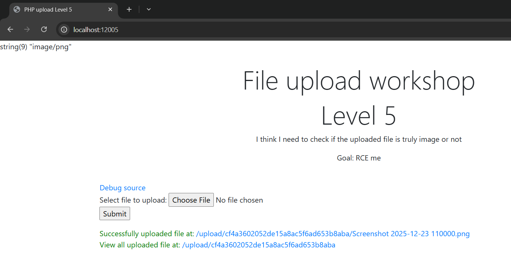
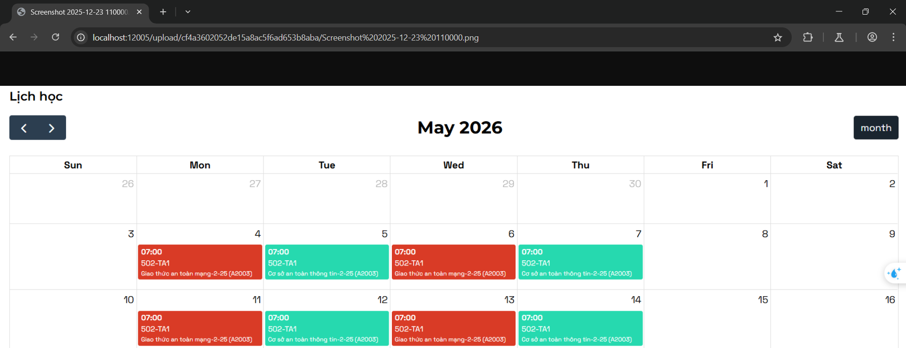
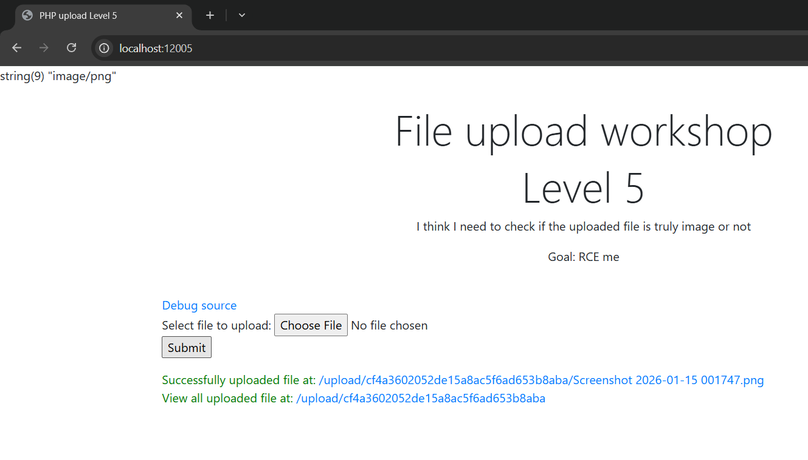
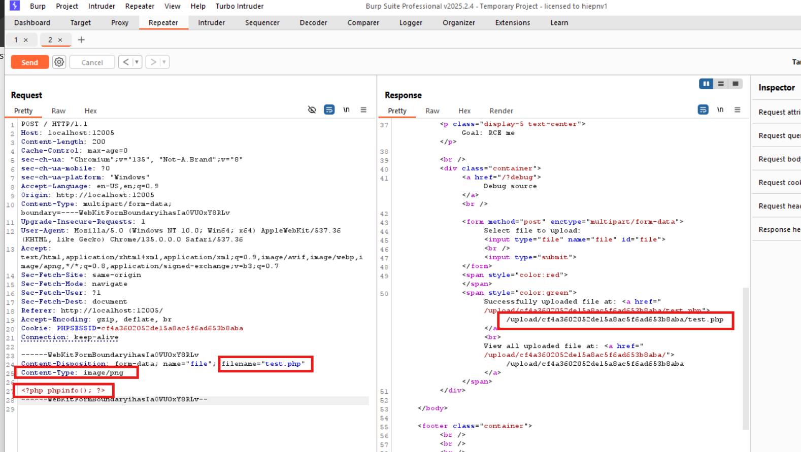
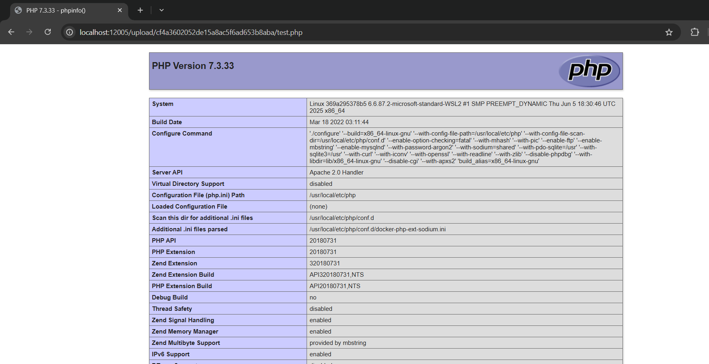
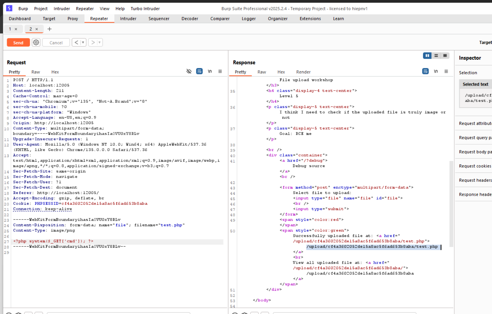
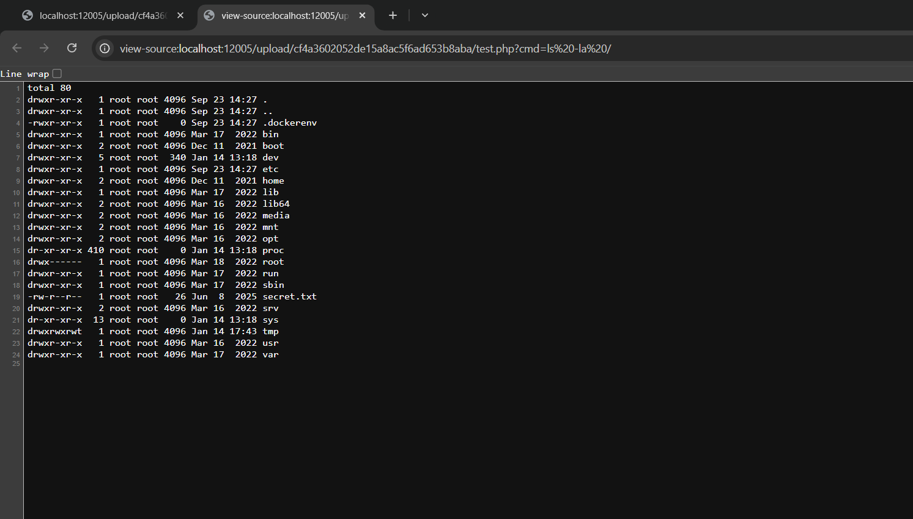

# File Upload ở localhost:12005
### 1. Tổng quan
lv5 là website cho phép upload ảnh và click link để xem lại ảnh đã up sau khi submit

### 2. Phạm vi
### 3. Lỗ hổng

#### Description 
Trang web `http://localhost:12005/` là 1 website cho phép upload ảnh và truy nhập trực tiếp ảnh sau khi submit bằng cách click vào link đó.
### Impact
Tại đây, kẻ xấu có thể upload ảnh chứa mã khai khác và thực thi mã tùy ý trên server, dẫn đến **Remote Code Execution (RCE)**.

#### Root-cause analysis
Trong file `\src\index.php`, mặc dù file upload lên đã được kiểm tra Content-Type bằng hàm `in_array`, chỉ cho phép upload những file nào có Content-Type là ảnh mà Content-Type có thể bị thay đổi trên BurpSuite

    $mime_type = $_FILES["file"]["type"];
    if (!in_array($mime_type, ["image/jpeg", "image/png", "image/gif"])) {
            die("Hack detected");
    }
    $file = $dir . "/" . $_FILES["file"]["name"];
    move_uploaded_file($_FILES["file"]["tmp_name"], $file);

Và anh dev không để ý hành vi của apache mà anh ta đã cấu hình. Apache2 chỉ nhìn vào extention từ đó quyết định xử lý file đó như thế nào, chứ không dựa vào Content-Type.
Vì Trong httpd Apache2, có một loại file cấu hình đặc biệt(`docker-php.conf`) để quyết định rằng loại file nào Apache2 sẽ đưa cho mod-php xử lý.  

Thấy trong mã nguồn `docker-php.conf` đang cấu hình sai hành vi của apache, dẫn tới việc cho phép apache sẽ đưa cho mod-php xử lý các extention **.php, .phar, .phtml**.  

    <FilesMatch ".+\.ph(ar|p|tml)$">
        SetHandler application/x-httpd-php
    </FilesMatch>

#### Steps to reproduce
1. Upload file ảnh bất kì
    

2. Vào BurpSuite 

Chỉnh sửa tên file cũng như nội dung của file, giữ nguyên Content-Type

3. Truy cập vào link

4. RCE

