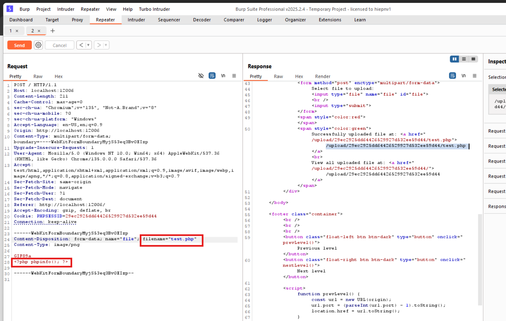
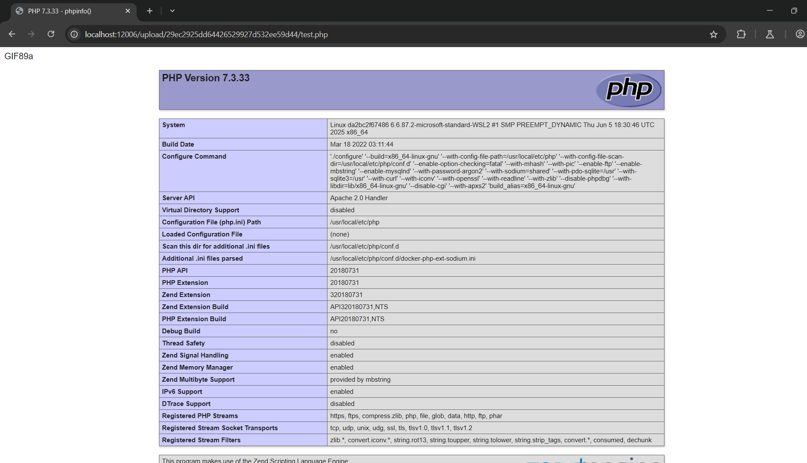
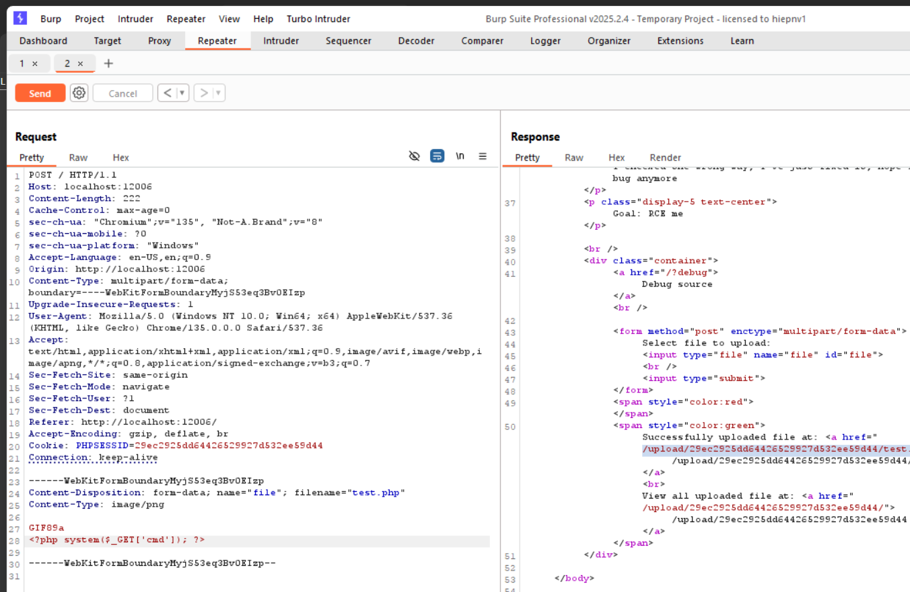
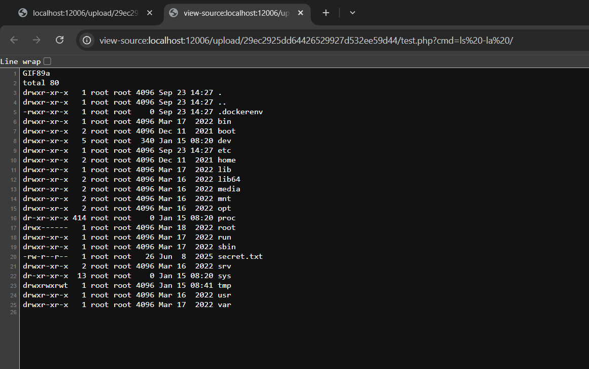

# File Upload ở localhost:12006
### 1. Tổng quan
lv6 là website cho phép upload ảnh và click link để xem lại ảnh đã up sau khi submit

### 2. Phạm vi
### 3. Lỗ hổng

#### Description 
Trang web `http://localhost:12006/` là 1 website cho phép upload ảnh hoặc file nén zip và truy nhập trực tiếp ảnh sau khi submit bằng cách click vào link đó.
### Impact
Tại đây, kẻ xấu có thể upload file zip chứa mã khai khác và thực thi mã tùy ý trên server, dẫn đến **Remote Code Execution (RCE)**.

### Root-cause analysis

Trong file `\src\index.php`, tại hàm `_unzip_file_ziparchive` ta thấy Untrusted data `$info['name']` để lấy thông tin của các file được zip như: tên, size, .... 

    for ($i = 0; $i < $z->numFiles; $i++) {
        if (! $info = $z->statIndex($i))
             return false; 
        if ('/' == substr($info['name'], -1))
            continue;

Và Untrusted data `getFromIndex($i)` để lấy nội dung của file đó.

    $contents = $z->getFromIndex($i);

Vậy sẽ ra sao nếu ta thay đổi tên file trước khi được zip cũng như để mã khai thác trong nội dung file 

#### Steps to reproduce
1. Upload file ảnh bất kì

2. Vào BurpSuite 

Chỉnh sửa tên file cũng như nội dung của file, giữ nguyên signature

3. Truy cập vào link

4. RCE

