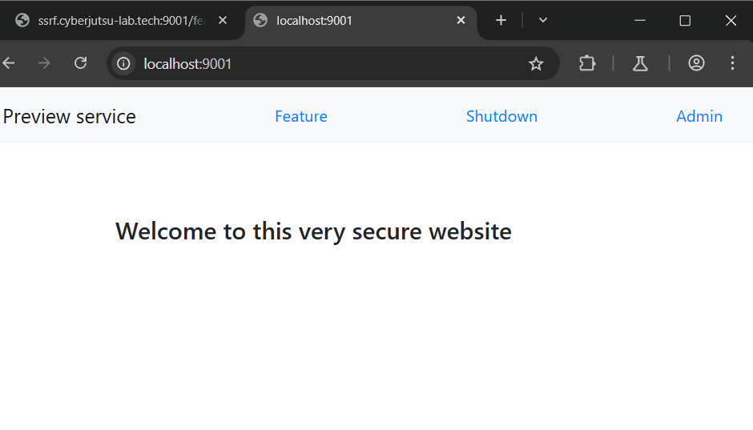
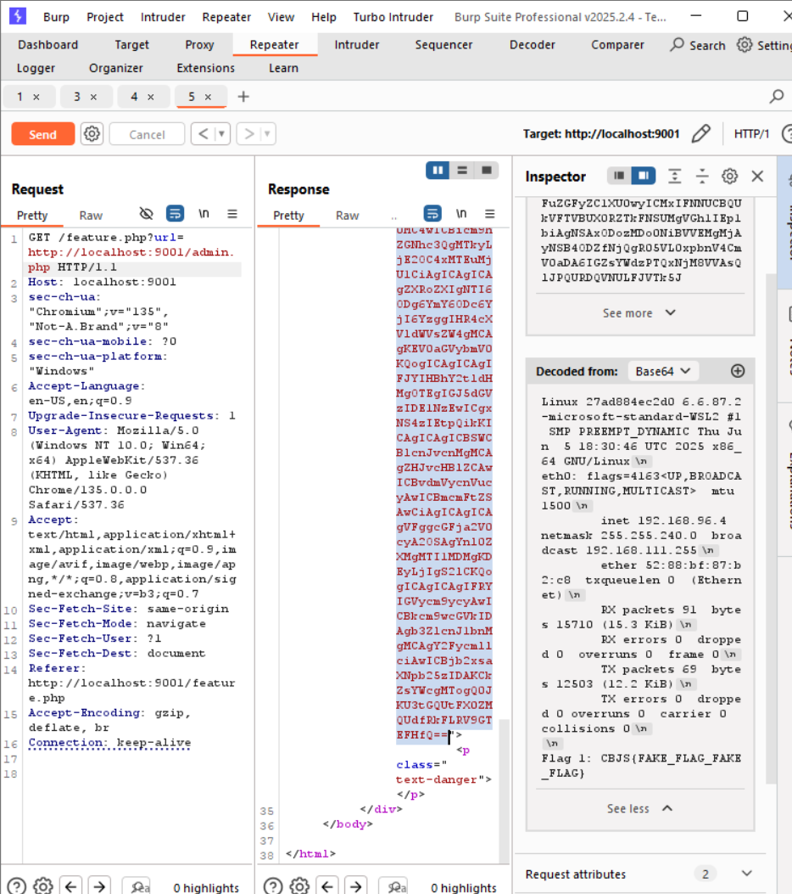

# SSRF ở localhost:9001/feature
### 1. Tổng quan

- lv2 là 1 website với 3 tab chính
    + Feature: Cho phép nhập 1 URL ảnh, ứng dụng sẽ truy cập tới URL đó và lấy ảnh về hiển thị cho người dùng
    + Shutdown: Khả năng làm sập nguồn website hoặc gì đó khiến website tạm thời không hoạt động được vì thế mới giới hạn chỉ có local (127.0.0.1) mới truy cập được
    + Admin: Trang web của admin, tương tự cũng chỉ cho truy cập từ local

    
Báo cáo này liệt kê các lỗ hổng bảo mật và những vấn đề liên quan được tìm thấy trong quá trình kiểm thử
website. Quá trình kiểm thử được thực hiện dưới hình thức blackbox/Whitebox testing.
### 2. Phạm vi
### 3. Lỗ hổng 

#### Description

Trang web `http://localhost:9001/` là 1 website cho phép nhập 1 URL ảnh bất kỳ
    
#### Impact

Tại đây, kẻ tấn công có thể giả vờ server bằng cách nhập URL nội bộ để nhờ server tự truy cập tới URL đó và thực thi điều xấu. 

#### Root-cause analysis

Trong mã nguồn `/web/src/feature.php`, Untrusted data `$_GET['url']` ở dòng số 7, tiếp đó đi qua hàm check cú pháp URL có hợp lệ hay không. Sau khi vượt qua bước kiểm tra, hàm `file_get_contents` sẽ đi đến URL user nhập lấy data về base64 encode, và lưu vào biến `$content`

    if (isset($_GET['url'])) {
        if (!filter_var($_GET['url'], FILTER_VALIDATE_URL)) {
            $error = 'Not a valid url';
        } else {
            $content = base64_encode(file_get_contents($_GET['url']));
        }
    }

Sau đó, biến `$content` sẽ được trả về giao diện cho người dùng.

    <?php if (strlen($content) > 0) {
            echo '';
        } ?>

Trong mã nguồn `/web/src/admin.php`, nếu người truy cập tới server có IP là 127.0.0.1 thì sẽ có quyền truy cập vào wb admin.

    if ($_SERVER['REMOTE_ADDR'] === "127.0.0.1") {
        system("uname -a");
        system("ifconfig eth0");
        die("Flag 1: CBJS{FAKE_FLAG_FAKE_FLAG}");
    }

Vậy sẽ ra sao nếu người dùng nhập URL nội bộ server vào feature để chính server(IP:127.0.0.1)
#### Steps to reproduce
Nhập URL local: `http://localhost:9001/admin.php` vào tab feature

    
#### Recommendations

    
    
    