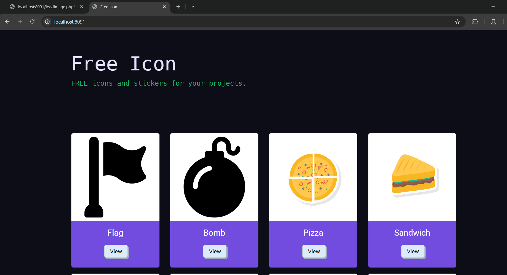
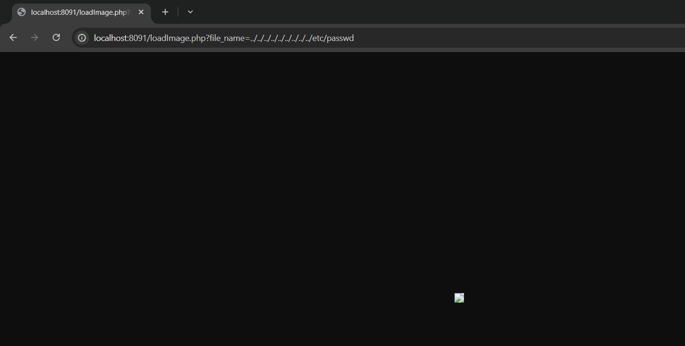
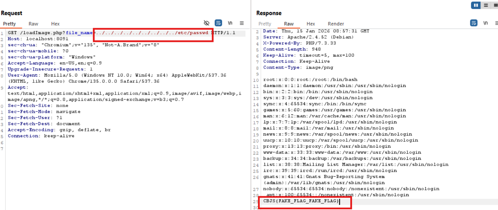

# PATH TRAVERSAL ở localhost:8091
### 1. Tổng quan
lv1 là website cho phép ta xem ảnh 

### 2. Phạm vi
### 3. Lỗ hổng
#### Description
localhost:8091 cho phép ta truy nhập vào ảnh có trên server bằng cách click View
#### Impact
Tại đây, kẻ tấn công có thể chỉnh sửa query trên URL và có thể dịch chuyển tới user root.
#### Root-cause analysis

Trong mã nguồn `src/loadImage`, biến `$file_name` truyền thẳng giá trị của tham số lên đường dẫn `/var/www/html/images/` dẫn tới việc kẻ xấu có thể di chuyển tự do trên server từ đó dẫn tới lỗ hổng Path Traversal

    $file_name = $_GET['file_name'];
    $file_path = '/var/www/html/images/' . $file_name;

#### Steps to reproduce
1. Thay đổi trường giá trị của param `file_name`

với giá trị `../../../../../etc/passwd`

2. Vào BurpSuite để đọc Flag

