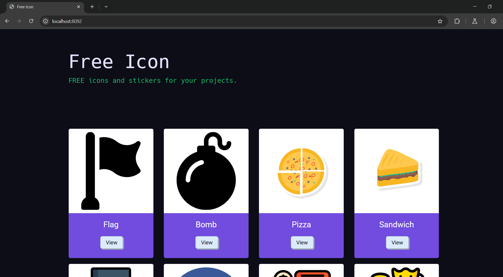
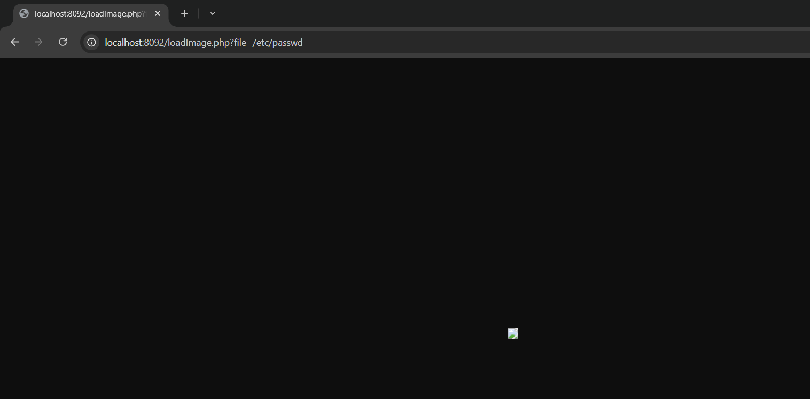
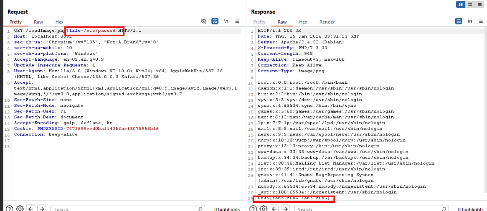

# PATH TRAVERSAL ở localhost:8092
### 1. Tổng quan
lv2 là website cho phép ta xem ảnh 

### 2. Phạm vi
### 3. Lỗ hổng
#### Description
localhost:8092 cho phép ta truy nhập vào ảnh có trên server bằng cách click View
#### Impact
Tại đây, kẻ tấn công có thể chỉnh sửa query trên URL và có thể dịch chuyển tới user root.
#### Root-cause analysis

Trong mã nguồn `src/loadImage`, mặc dù biến `$file_name` đã được validate dấu `..` 

    $file = $_GET['file'];
    if (strpos($file, "..") !== false)
        die("Hack detected");

Nhưng lại đẩy thẳng biến `$file_name` là 1 Untrusted data vào hàm readfile(): hàm có thể đọc bất cứ file gì có trên server

    if (file_exists($file)) {
        header('Content-Type: image/png');
        readfile($file);
    }

#### Steps to reproduce
1. Thay đổi trường giá trị của param `file`

với giá trị là đường dẫn tuyệt đối `/etc/passwd`

2. Vào BurpSuite để đọc Flag

