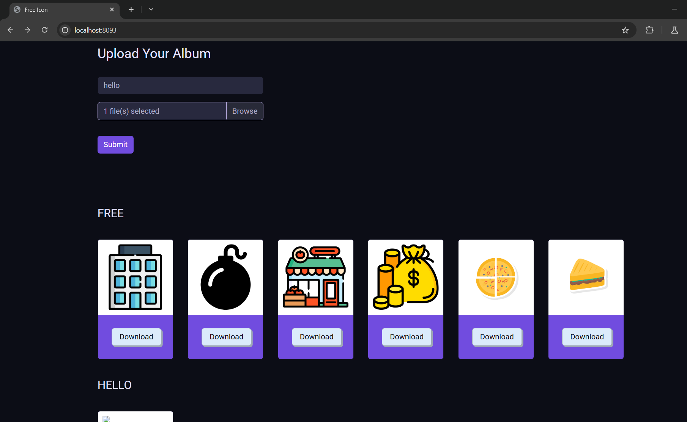
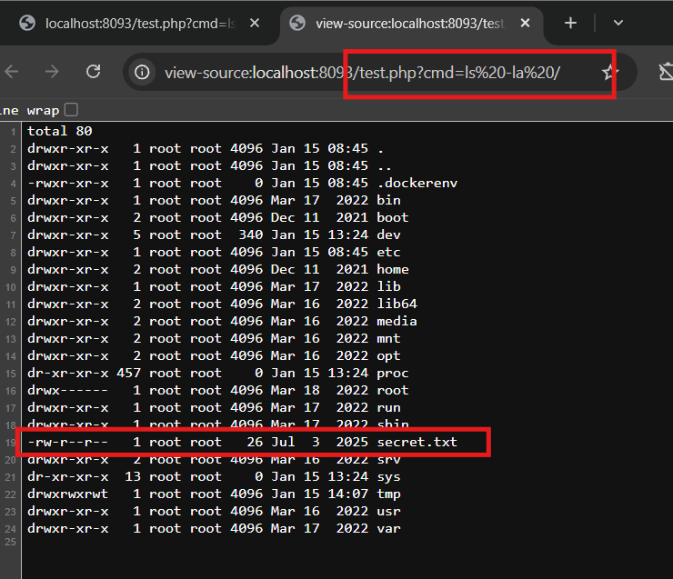

# PATH TRAVERSAL ở localhost:8093
### 1. Tổng quan
lv3 là website cho phép ta xem ảnh, upload file và đặt tên cho file đó

### 2. Phạm vi
### 3. Lỗ hổng
#### Description
localhost:8093 cho phép ta truy nhập vào ảnh có trên server bằng cách click View với chức năng upload file lên server
#### Impact
Tại đây, kẻ tấn công có thể chỉnh sửa query trên URL và có thể dịch chuyển tới user root.
#### Root-cause analysis
Trong mã nguồn `src/index.php`, biến `$album` được lấy từ Post Request mà không được validate, dẫn tới kẻ xấu có thể kiểm soát được biến này.

    $album = $dir . "/" . strtolower($_POST['album']); 
    if ( !file_exists($album))
        mkdir($album);

Cũng trong mã nguồn `src/index.php`, Unsafe method `move_uploaded_file($files["tmp_name"][$i], $newFile);` sẽ upload file `$files["tmp_name"][$i]` vào đường dẫn `$newFile` mà ta có thể kiểm soát được biến `$album` dẫn tới việc có thể điều hướng upload file vào thư mục **Document Root**

    for ($i = 0; $i < $count; $i++) {
        $newFile = $album . "/" . $files["name"][$i];
        move_uploaded_file($files["tmp_name"][$i], $newFile);
    }

#### Steps to reproduce
1. Upload file test.php và đặt tên cho album: ../.. 

Với nội dung file test.php

    <?php phpinfo(); ?>

2. Truy cập vào API test.php trên url

