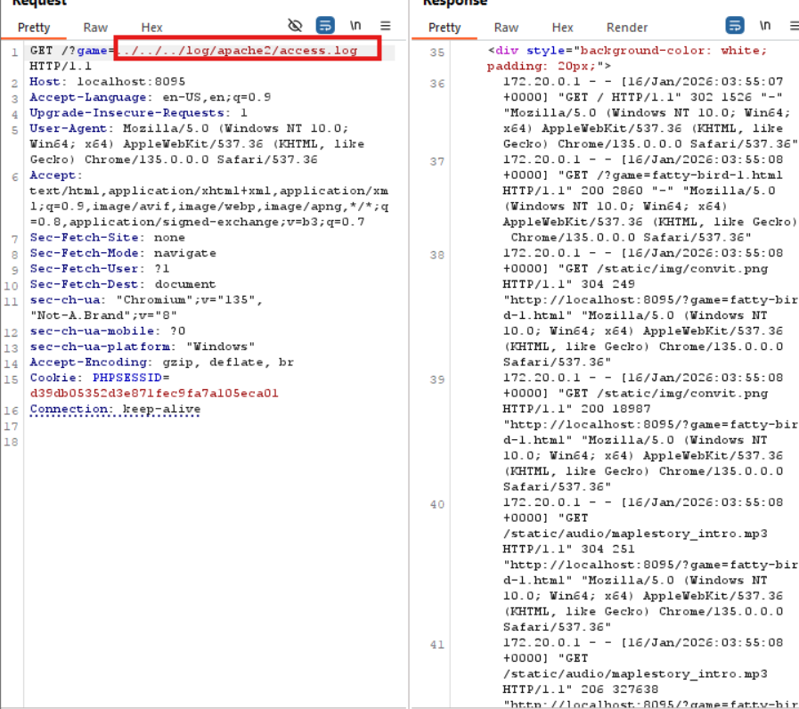
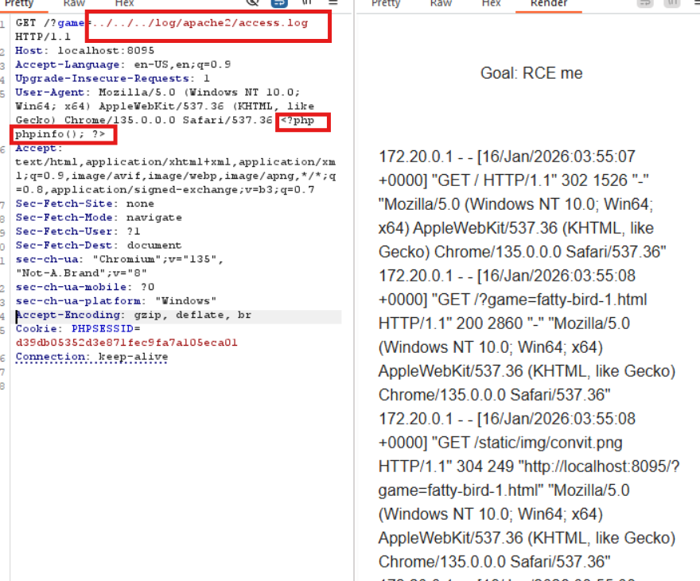
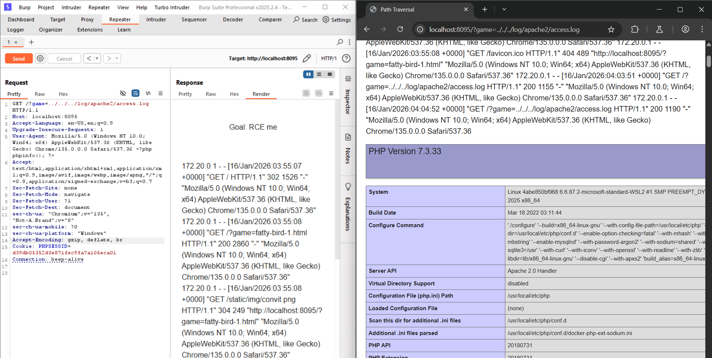

# PATH TRAVERSAL ở localhost:8095
### 1. Tổng quan
lv5 là website để chơi fatty bird
### 2. Phạm vi
### 3. Lỗ hổng
#### Description
localhost:8095 cho phép ta chơi game với game mặc định là fatty bird 1
#### Impact
Tại đây, kẻ tấn công có thể thay đổi giá trị của param `game` và di chuyển tới **Document Root**
#### Root-cause analysis
Trong mã nguồn `src/game.php`, người chơi không chọn mà chơi sẽ mặc định game là fatty-bird, muốn đổi game khác thì phải thay đổi giá trị của param `game` trên URL

    if (!isset($_GET['game'])) {
        header('Location: /?game=fatty-bird-1.html');
    }
    $game = $_GET['game'];

Và ván game sẽ được execute thông qua hàm `include`, mà biến `$game` sẽ bị thao túng bởi người chơi, dẫn tới việc kẻ xấu có thể thực thi bất kì file nào có trên hệ thống.

    

        <?php include './views/' . $game; ?>
    

#### Step to reproduce
1. Thay đổi giá trị của param `game` trên URL để xem log

Tại mã nguồn `configs/000-default.conf`, thông thường người ta sẽ cấu hình 2 file access.log và error.log để theo dõi các request gửi lên server và điều tra khi có sự cố trong lúc xử lý request.

        ErrorLog ${APACHE_LOG_DIR}/error.log
        CustomLog ${APACHE_LOG_DIR}/access.log combined

Thay đổi giá trị param là  `../../../log/apache2/access.log`  để xem access.log, thấy ở đây chứa các HTTP request gửi lên server

Mà trong nội dung của access.log chứa các thông tin:

Souce IP -> Timestamp -> Request String -> Status Code ->Byte Sent -> Referer -> User-Agent 

Trong khi đó, một số trường có thể bị thay đổi trước khi request được gửi lên server: Referer, User-Agent, Request String.

2. Thử gửi 1 Get Request có User-Agent chứa mã PHP

3. Sau đó hàm include sẽ dọc access.log 

Và khi thấy mã PHP sẽ execute code PHP

