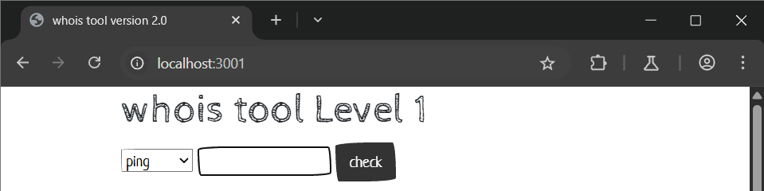
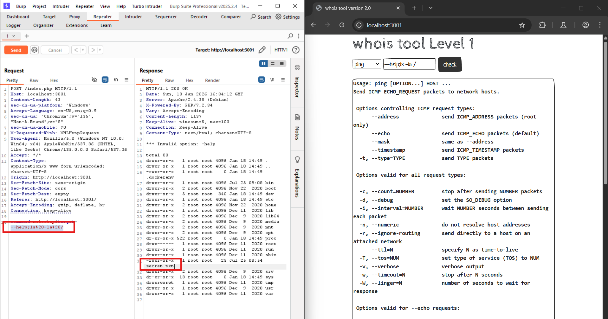

# OS Command Injection localhost:3001
### 1. Tổng quan
lv1 là website cho phép người dùng thực hiện nslookup, dig, hoặc ping đến một IP nào đó

### 2. Phạm vi
### 3. Lỗ hổng
#### Description
localhost:3001 cho phép thực hiện nslookup, dig, hoặc ping đến một IP nào đó
#### Impact
Kẻ xấu có thể chạy lệnh OS
#### Root-cause analysis

Trong mã nguồn `/src/index.php`, User input không hề được validate mà được đưa trực tiếp vào hàm `shell_exec()`. 

    $command = $_POST['command'];
    $target = $_POST['target'];
	switch($command) {
		case "ping":
			$result = shell_exec("timeout 10 ping -c 4 $target 2>&1");
			break;

Vậy liệu hàm `shell_exec()` có thể chạy lệnh OS của ta không? 

Liệu có thể thực thi được nhiều câu lệnh OS cùng 1 lúc không?

#### Step to reproduce

Sử dụng dấu `;` để kết thúc câu lệnh ban đầu và thực thi OS Command của ta

Payload: `--help;ls -la /`

