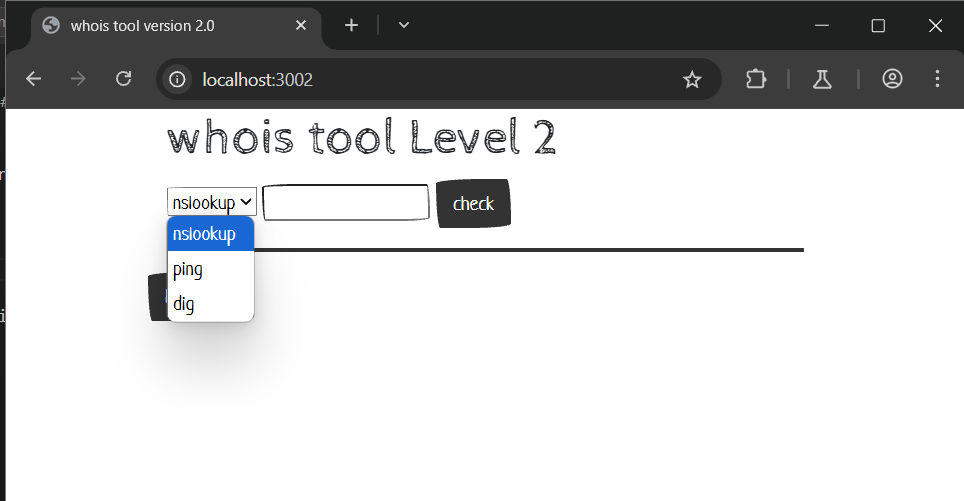
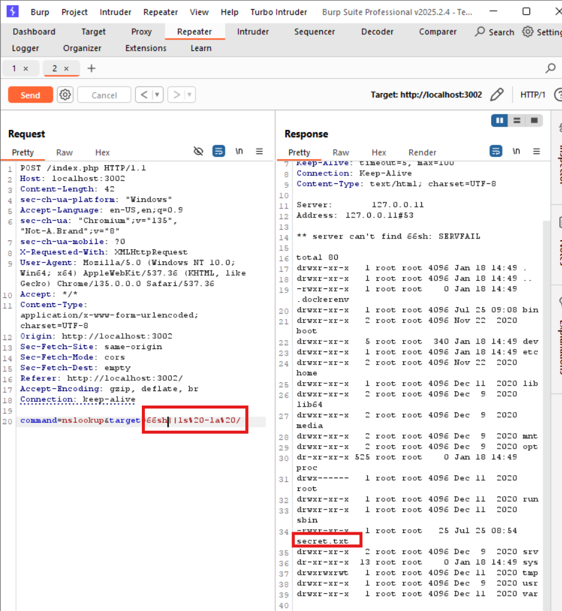

# OS Command Injection localhost:3002
### 1. Tổng quan
lv2 là website cho phép người dùng thực hiện nslookup, dig, hoặc ping đến một IP nào đó

### 2. Phạm vi
### 3. Lỗ hổng
#### Description
localhost:3002 cho phép thực hiện nslookup, dig, hoặc ping đến một IP nào đó
#### Impact
Kẻ xấu có thể chạy lệnh OS
#### Root-cause analysis

Trong mã nguồn `/src/index.php`,User input đã được kiểm tra bằng hàm `strpos()` xem có tồn tại dấu `;` không để tránh thực thi nhiều OS Command khi đưa vào hàm `shell_exec`.

    $command = $_POST['command'];
    $target = $_POST['target'];
    if (strpos($target, ";") !== false) 
        die("Hacker detected!");
	switch($command) {
		case "ping":
			$result = shell_exec("timeout 10 ping -c 4 $target 2>&1"); 
            break;

Vậy liệu ngoài dấu `;` ra còn kí tự đặc biệt nào khác trong Linux có thể thực thi nhiều OS Command trên cùng 1 dòng không ?

#### Step to reproduce

Sử dụng dấu `&&` hoặc `||` để thực thi câu lệnh ban đầu sau đó thực thi OS Command của ta

Payload: `66sh||ls -la /`

