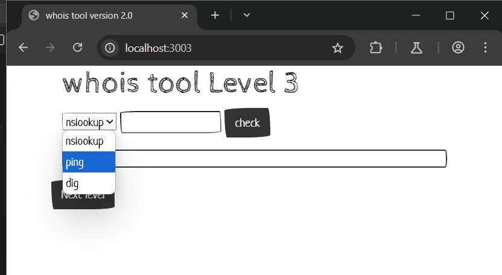
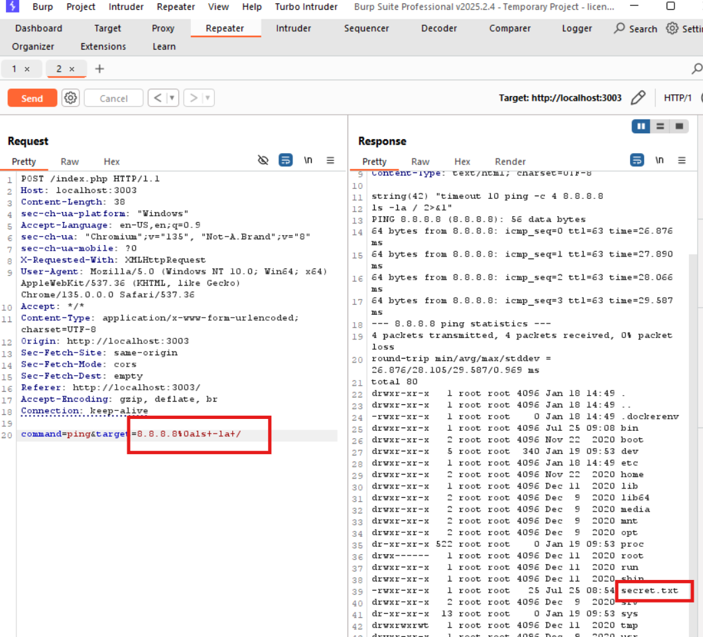

# OS Command Injection localhost:3003
### 1. Tổng quan
lv3 là website cho phép người dùng thực hiện nslookup, dig, hoặc ping đến một IP nào đó

### 2. Phạm vi
### 3. Lỗ hổng
#### Description
localhost:3003 cho phép thực hiện nslookup, dig, hoặc ping đến một IP nào đó
#### Impact
Kẻ xấu có thể chạy lệnh OS
#### Root-cause analysis

Trong mã nguồn `/src/index.php`,User input đã được kiểm tra bằng hàm `strpos()` xem có tồn tại dấu `;`,`|`,`&` không, để tránh thực thi nhiều OS Command khi đưa vào hàm `shell_exec`.

    if (strpos($target, ";") !== false)
        die("Hacker detected!");
    if (strpos($target, "&") !== false)
        die("Hacker detected!");
    if (strpos($target, "|") !== false)
        die("Hacker detected!");
    switch ($command) {
        case "ping":
            $cmd = "timeout 10 ping -c 4 $target 2>&1";
            $result = shell_exec($cmd);
            break;

Vậy liệu ngoài dấu `;`,`|`,`&` ra còn kí tự đặc biệt nào khác trong Linux có thể thực thi nhiều OS Command trên cùng 1 dòng không ?

#### Step to reproduce

Ta sẽ dùng ký tự xuống dòng trong linux để nối dài câu OS Command

Sử dụng Encode để biểu thị cho dấu xuống dòng. URL encode của ký tự xuống dòng la: `%0a`

