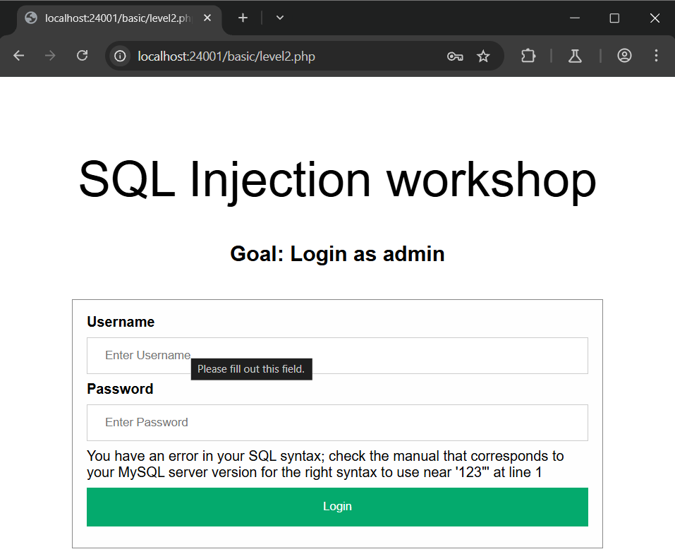
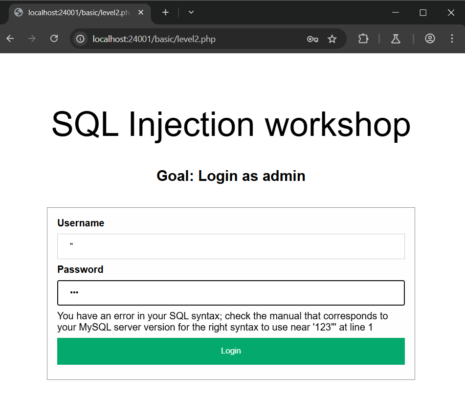
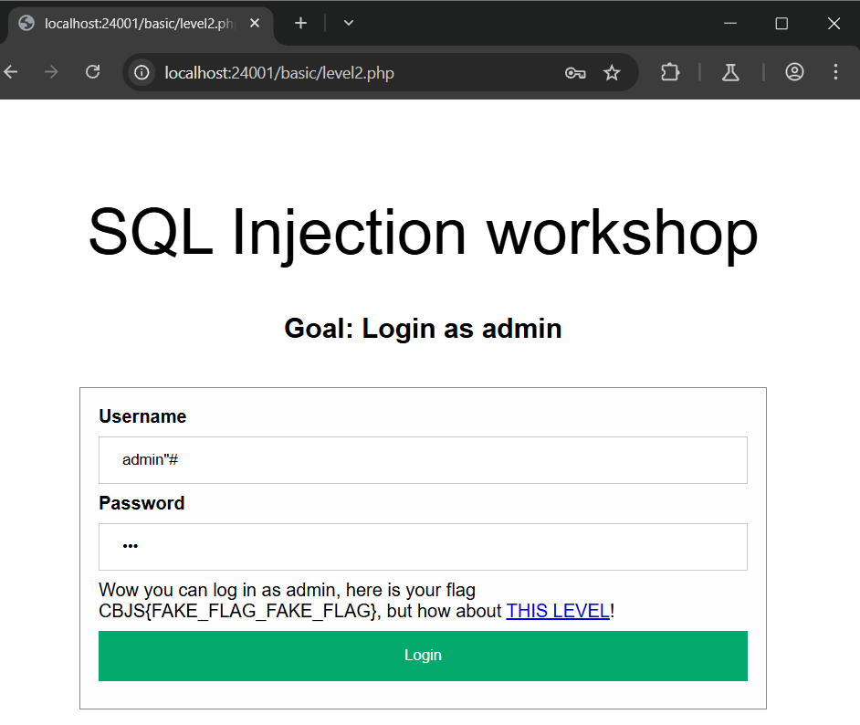

# SQL INJECTION localhost:24001/basic/level2.php
### 1. Tổng quan
lv1 là website để login 

### 2. Phạm vi
### 3. Lỗ hổng
#### Description
localhost:24001/basic/level2.php cho phép thực hiện login
#### Impact
Kẻ xấu có thể thực thi 1 phần/toàn bộ SQL query trên server
#### Root-cause analysis

Trong mã nguồn `/src/basic/level2.php`, anh dev đã nối chuỗi SQL query với user input là biến  `$_POST["username"]` và biến `$_POST["password"]` mà không hề có sự kiểm tra.

    $sql = "SELECT username FROM users WHERE username=\"$username\" AND password=\"$password\"";
	$query = $database->query($sql);
	$row = $query->fetch_assoc();

`$row = $query->fetch_assoc()` sẽ lấy hàng đầu tiên từ kết quả trả về. Và hiện tại username đang được bọc trong dấu nháy kép `"username"` .

    if ($row === NULL)
		return "Wrong username or password"; // No result

	$login_user = $row["username"];
	if ($login_user === "admin")
		return "Wow you can log in as admin, here is your flag CBJS{FAKE_FLAG_FAKE_FLAG}, but how about <a href='level3.php'>THIS LEVEL</a>!";
	else
		return "You log in as $login_user, but then what? You are not an admin";

Vậy sẽ ra sao nếu nhập username là `admin"` ?

#### Step to reproduce

1. Kiểm tra có tồn tại SQL Injection

Lúc này SQL query bị lỗi syntax vì dấu `"` không được đóng lại

2. Login tài khoản admin

Khi này ta có thể điều chỉnh syntax cho hợp lệ bằng cách dùng dấu `"` và dùng dấu `--` hoặc `#` để comment phần đằng sau cửa SQL
Payload: `admin"-- -` hoặc `admin"#`

