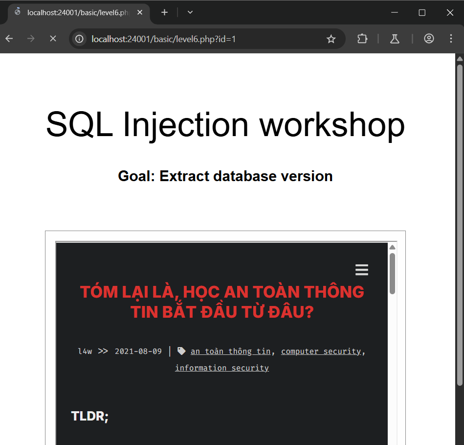
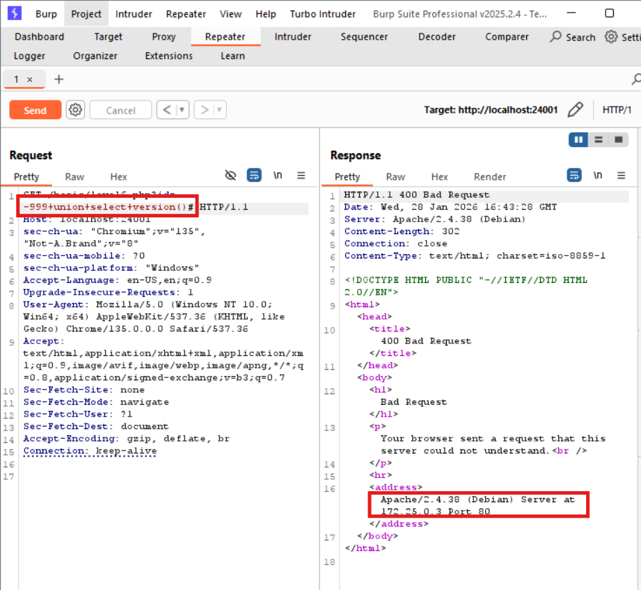

# SQL INJECTION localhost:24001/basic/level6.php
### 1. Tổng quan
lv6 là website xem bài blog

### 2. Phạm vi
### 3. Lỗ hổng
#### Description
localhost:24001/basic/level6.php cho phép xem các bài blog
#### Impact
Kẻ xấu có thể thực thi 1 phần/toàn bộ SQL query trên server
#### Root-cause analysis

Trong mã nguồn `/src/basic/level6.php`, biến `id` được lấy trực tiếp từ URL của người dùng. Mặc dù anh dev đã cẩn thận nhét user input vào bên trong hàm `real_escape_string()` để escape ký tự đặc biệt. Nhưng biến id có data type: integer, dẫn tới hàm `real_escape_string()` không hề có tác dụng
 
-> Vậy ta không cần dùng bất kỳ ký tự đặc biệt để thoát khỏi string mà vẫn có thể nối dài được

    $id = $database->real_escape_string($_GET["id"]);
    $sql = "SELECT content FROM posts WHERE id=$id";

#### Step to reproduce

1. Đọc database version của website

Payload: `-999 UNION SELECT version()#` hoặc `-999 UNION SELECT @@version#`

