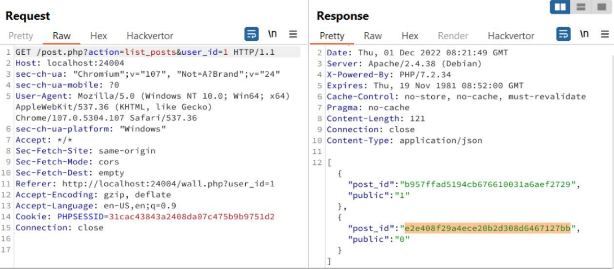
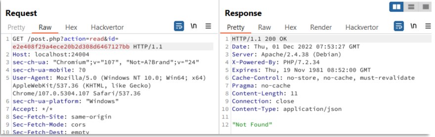
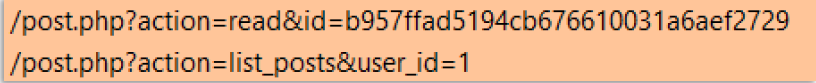
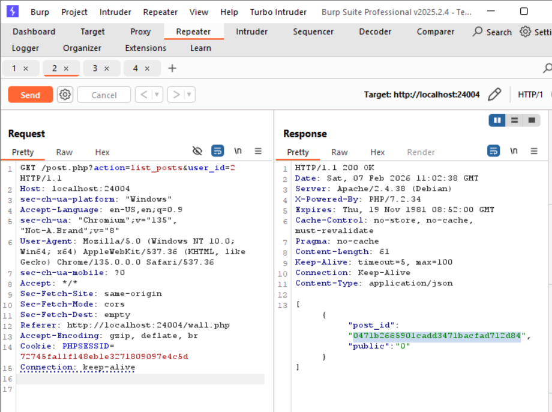
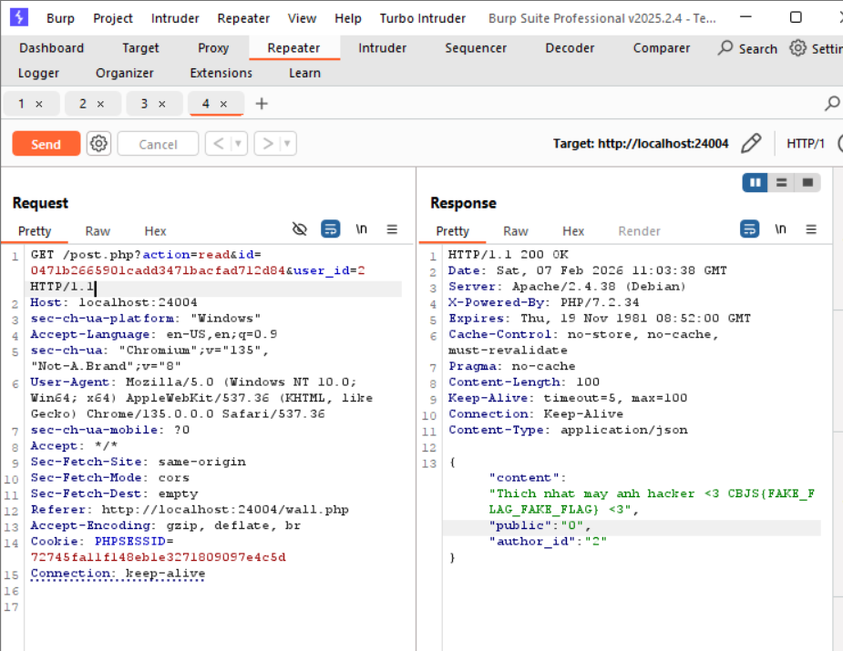

Ở lv4, chúng ta vẫn có thể đọc post_id thông qua `?action=list+posts`.
    

Tuy nhiên, khi gửi request đến  post private với post_id thì không thể đọc được, dù post này đã tồn tại trong Database.

Do anh dev đã sửa câu truy vấn đọc content bài post bằng cách thêm điều kiện là ngoài truy vấn theo post_id được lấy từ `$_GET['id']`, cần thoả mãn 1 trong 2 câu điều kiện sau:

Bài post đó phải public (public = 1)
Hoặc người gửi request đọc post phải là chủ bài post (user_id =
author_id)

    case 'read'
        $post = select_one(
            'SELECT content, public, author_id FROM posts
            WHERE post_id = ? AND (public = 1 OR author_id = ?)',
            $_GET['id'],
            $user_id
        );

`SELECT content, public, author_id FROM posts WHERE post_id = ? AND public = 1` : post_id đó phải ở chế độ public mới có thể đọc được.

hoặc

`SELECT content, public, author_id FROM posts WHERE post_id = ? AND author_id = ?` : post_id phải có cùng author_id với user_id, nhưng user_id lại là Untrusted data. 

    $user_id = $_SESSION['user_id'];
    if (isset($_GET['user_id']))
    $user_id = $_GET['user_id'];

Nếu không tồn tại tham số user_id trên query thì mặc định biến `$user_id` là `$_SESSION['user_id']`. 

Quan sát gói tin, ta thấy tham số user_id được truyền vào
ở `?action=list_posts`.

Vậy sẽ ra sao nếu ta thêm tham số `user_id` là `user_id` của crush và đổi `post_id` là `post_id` của crush ?

#### Step to Reproduce
1. Đi tìm `post_id` của crush
Đổi user_id = 2

2. Thêm tham số `user_id` của crush
