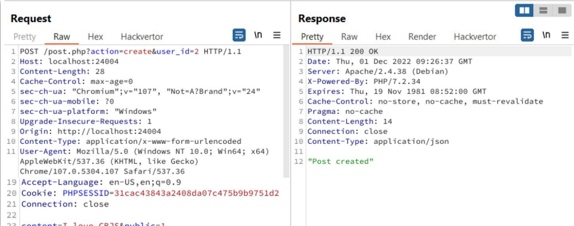
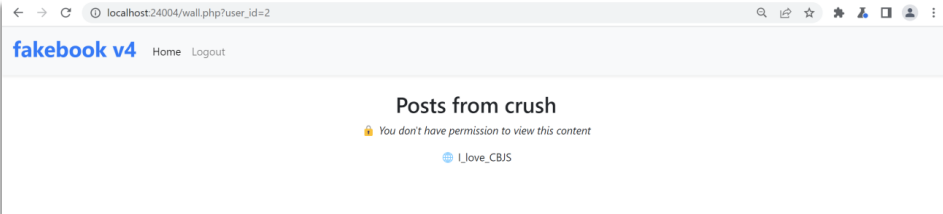

Ngoài câu truy vấn đọc ở level 4.1, khiến nạn nhân bị hacker đọc được các bài post private nhờ Untrusted data `$user_id`. Thì chức năng tạo post của trang web cũng dựa vào giá trị `$user_id` để làm giá trị cho `author_id`.

    case 'create':
        $res = exec_query(
            'INSERT INTO posts (post_id, content, public, author_id) VALUES (?, ?, ?, ?);',
            generate_id(),
            $_POST['content'],
            $_POST['public'],
            $user_id
        );

Vậy sẽ ra sao nếu ta tạo post public với user_id của user khác thì có thể tạo được post dưới danh nghĩa của người đó không?
#### Step to Reproduce
1. Tạo post với danh nghĩa user khác
Tại `/post.php?action=create` thêm tham số user_id để thử tạo bài post public trên trang của crush.

2. Xem bài post mình tạo tại trang crush (user_id = 2)
